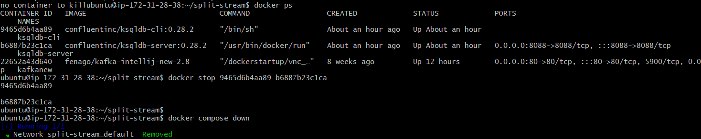

Lab: ksqlDB Quickstart
======================

The guide below demonstrates how to get a minimal environment up and running.


## Prerequisites

This lab installs Confluent Platform using Docker. Before proceeding:

- Connect with lab environment VM using SSH:

    `ssh USERNAME@YOUR_VM_DNS.courseware.io`

  *  **Username:** Will be provided by Instructor.

  *  **Password:** Will be provided by Instructor.

- Verify that Docker is set up properly by ensuring no errors are output when you run `docker info` and `docker compose version` on the command line.


### 1. Get standalone ksqlDB

Since ksqlDB runs natively on Apache Kafka®, you'll need to have a Kafka
installation running that ksqlDB is configured to use. The
docker-compose files to the right will run everything for you via
Docker, including ksqlDB itself.

Copy and paste following content into a file named `docker-compose.yml` on your local filesystem. You can run ` nano docker-compose.yml` command to create and edit file using nano editor.


```
---
version: '2'

services:
  zookeeper:
    image: confluentinc/cp-zookeeper:6.1.0
    hostname: zookeeper
    container_name: zookeeper
    ports:
      - "2181:2181"
    environment:
      ZOOKEEPER_CLIENT_PORT: 2181
      ZOOKEEPER_TICK_TIME: 2000

  broker:
    image: confluentinc/cp-kafka:6.1.0
    hostname: broker
    container_name: broker
    depends_on:
      - zookeeper
    ports:
      - "29092:29092"
    environment:
      KAFKA_BROKER_ID: 1
      KAFKA_ZOOKEEPER_CONNECT: 'zookeeper:2181'
      KAFKA_LISTENER_SECURITY_PROTOCOL_MAP: PLAINTEXT:PLAINTEXT,PLAINTEXT_HOST:PLAINTEXT
      KAFKA_ADVERTISED_LISTENERS: PLAINTEXT://broker:9092,PLAINTEXT_HOST://localhost:29092
      KAFKA_OFFSETS_TOPIC_REPLICATION_FACTOR: 1
      KAFKA_GROUP_INITIAL_REBALANCE_DELAY_MS: 0
      KAFKA_TRANSACTION_STATE_LOG_MIN_ISR: 1
      KAFKA_TRANSACTION_STATE_LOG_REPLICATION_FACTOR: 1

  ksqldb-server:
    image: confluentinc/ksqldb-server:0.15.0
    hostname: ksqldb-server
    container_name: ksqldb-server
    depends_on:
      - broker
    ports:
      - "8088:8088"
    environment:
      KSQL_LISTENERS: http://0.0.0.0:8088
      KSQL_BOOTSTRAP_SERVERS: broker:9092
      KSQL_KSQL_LOGGING_PROCESSING_STREAM_AUTO_CREATE: "true"
      KSQL_KSQL_LOGGING_PROCESSING_TOPIC_AUTO_CREATE: "true"

  ksqldb-cli:
    image: confluentinc/ksqldb-cli:0.15.0
    container_name: ksqldb-cli
    depends_on:
      - broker
      - ksqldb-server
    entrypoint: /bin/sh
    tty: true
```


### 2. Start ksqlDB's server

From a directory containing the docker-compose.yml file created in the
previous step, run this command in order to start all services in the
correct order.


Once all services have successfully launched, you will have a ksqlDB
server running and ready to use.

```
docker compose up -d
```


### 3. Start ksqlDB's interactive CLI

ksqlDB runs as a server which clients connect to in order to issue
queries.


Run this command to connect to the ksqlDB server and enter an
interactive command-line interface (CLI) session.

```
    docker exec -it ksqldb-cli ksql http://ksqldb-server:8088
```

### 4. Create a stream

The first thing we're going to do is create a `stream`.
A stream essentially associates a schema with an underlying Kafka topic.
Here's what each parameter in the CREATE STREAM statement does:


-   **kafka\_topic -** Name of the Kafka topic underlying the stream. In
    this case it will be automatically created because it doesn't exist
    yet, but streams may also be created over topics that already exist.
-   **value\_format -** Encoding of the messages stored in the Kafka
    topic. For JSON encoding, each row will be stored as a JSON object
    whose keys/values are column names/values. For example:
    {"profileId": "c2309eec", "latitude": 37.7877, "longitude":
    -122.4205}
-   **partitions -** Number of partitions to create for the locations
    topic. Note that this parameter is not needed for topics that
    already exist.


Copy and paste this statement into your interactive CLI session, and
press enter to execute the statement.

```
    CREATE STREAM riderLocations (profileId VARCHAR, latitude DOUBLE, longitude DOUBLE)
      WITH (kafka_topic='locations', value_format='json', partitions=1);
```


### 5. Run a persistent query over the stream

Run the given query using your interactive CLI session.

This query will output all rows from the riderLocations stream whose
coordinates are within 5 miles of Mountain View.

This is the first thing that may feel a bit unfamiliar to you, because
the query will never return until it's terminated. It will perpetually push output
rows to the client as events are written to the riderLocations stream.

Leave this query running in the CLI session for now. Next, we're going
to write some data into the riderLocations stream so that the query
begins producing output.

```
    -- Mountain View lat, long: 37.4133, -122.1162
    SELECT * FROM riderLocations
      WHERE GEO_DISTANCE(latitude, longitude, 37.4133, -122.1162) <= 5 EMIT CHANGES;
```

### 6. Start another CLI session

Since the CLI session from (5) is busy waiting for output from the
persistent query, let's start another session that we can use to write
some data into ksqlDB.


```
    docker exec -it ksqldb-cli ksql http://ksqldb-server:8088
```

**Note:** You will need to first connect with lab machine using SSH in new terminal.

### 7. Populate the stream with events

Run each of the given INSERT statements
within the new CLI session, and keep an eye on the CLI session from (5)
as you do.

The persistent query will output matching rows in real time as soon as
they're written to the riderLocations stream.

```
    INSERT INTO riderLocations (profileId, latitude, longitude) VALUES ('c2309eec', 37.7877, -122.4205);
    INSERT INTO riderLocations (profileId, latitude, longitude) VALUES ('18f4ea86', 37.3903, -122.0643);
    INSERT INTO riderLocations (profileId, latitude, longitude) VALUES ('4ab5cbad', 37.3952, -122.0813);
    INSERT INTO riderLocations (profileId, latitude, longitude) VALUES ('8b6eae59', 37.3944, -122.0813);
    INSERT INTO riderLocations (profileId, latitude, longitude) VALUES ('4a7c7b41', 37.4049, -122.0822);
    INSERT INTO riderLocations (profileId, latitude, longitude) VALUES ('4ddad000', 37.7857, -122.4011);
```


### Cleanup Resources


Delete all the resources by running following command in the `docker-compose.yml` file directory from the terminal:

```
docker compose down

docker container prune
```


**Note:** If you get above error while running above command. Manually stop the containers and run `docker compose down` again. **Do not delete kafkanew container**.


