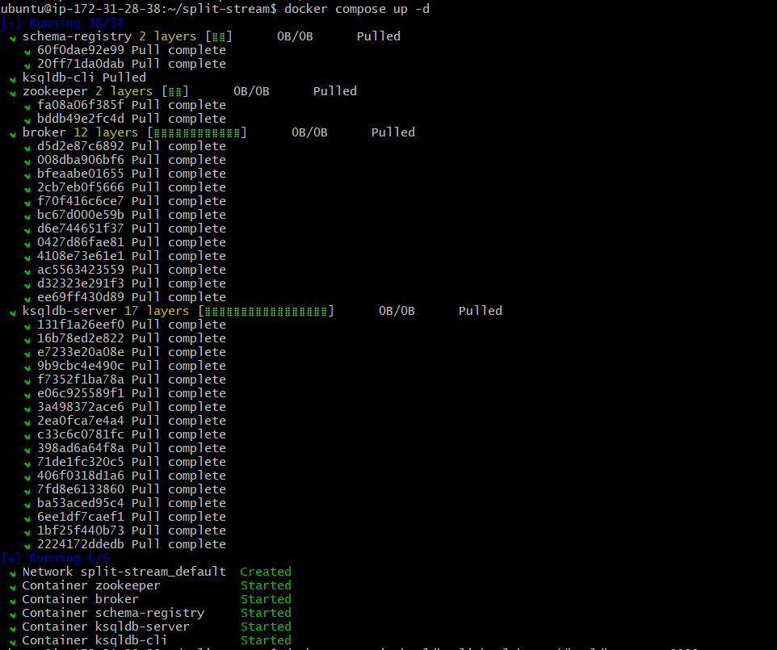
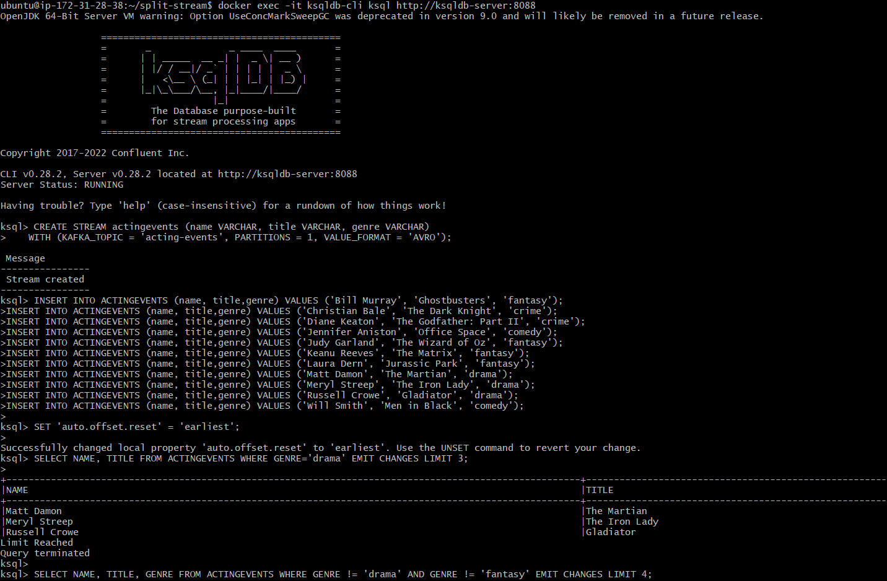

# Lab: Split a stream of events into substreams

### Problem Statement:

How do you split events in a Kafka topic so that the events are placed
into subtopics?


### Example use case:

Suppose that you have a Kafka topic representing appearances of an actor
or actress in a film, with each event denoting the genre. In this
lab, we\'ll write a program that splits the stream into substreams
based on the genre. We\'ll have a topic for drama films, a topic for
fantasy films, and a topic for everything else.


### Hands-on code example:


**Run it**

1. Prerequisites
2. Initialize the project
3. Get Confluent Platform
4. Write the program interactively using the CLI
5. Write your statements to a file

**Test it**

1. Create the test data
2. Invoke the tests

## Run it


## Prerequisites

This lab installs Confluent Platform using Docker. Before
proceeding:

- Connect with lab environment VM using SSH:

    `ssh USERNAME@YOUR_VM_DNS.courseware.io`

  *  **Username:** Will be provided by Instructor.

  *  **Password:** Will be provided by Instructor.

- Verify that Docker is set up properly by ensuring no errors are output when you run `docker info` and `docker compose version` on the command line.


## Initialize the project


To get started, make a new directory anywhere you'd like for this
project:


```
mkdir split-stream && cd split-stream
```


Then make the following directories to set up its structure:


```
mkdir src test
```


## Get Confluent Platform


Next, create the following `docker-compose.yml` file to obtain Confluent
Platform:

```
---
version: '2'

services:
  zookeeper:
    image: confluentinc/cp-zookeeper:7.3.0
    hostname: zookeeper
    container_name: zookeeper
    ports:
      - "2181:2181"
    environment:
      ZOOKEEPER_CLIENT_PORT: 2181
      ZOOKEEPER_TICK_TIME: 2000

  broker:
    image: confluentinc/cp-kafka:7.3.0
    hostname: broker
    container_name: broker
    depends_on:
      - zookeeper
    ports:
      - "29092:29092"
    environment:
      KAFKA_BROKER_ID: 1
      KAFKA_ZOOKEEPER_CONNECT: 'zookeeper:2181'
      KAFKA_LISTENER_SECURITY_PROTOCOL_MAP: PLAINTEXT:PLAINTEXT,PLAINTEXT_HOST:PLAINTEXT
      KAFKA_ADVERTISED_LISTENERS: PLAINTEXT://broker:9092,PLAINTEXT_HOST://localhost:29092
      KAFKA_OFFSETS_TOPIC_REPLICATION_FACTOR: 1
      KAFKA_TRANSACTION_STATE_LOG_MIN_ISR: 1
      KAFKA_TRANSACTION_STATE_LOG_REPLICATION_FACTOR: 1
      KAFKA_GROUP_INITIAL_REBALANCE_DELAY_MS: 0

  schema-registry:
    image: confluentinc/cp-schema-registry:7.3.0
    hostname: schema-registry
    container_name: schema-registry
    depends_on:
      - broker
    ports:
      - "8081:8081"
    environment:
      SCHEMA_REGISTRY_HOST_NAME: schema-registry
      SCHEMA_REGISTRY_KAFKASTORE_BOOTSTRAP_SERVERS: 'broker:9092'

  ksqldb-server:
    image: confluentinc/ksqldb-server:0.28.2
    hostname: ksqldb-server
    container_name: ksqldb-server
    depends_on:
      - broker
      - schema-registry
    ports:
      - "8088:8088"
    environment:
      KSQL_CONFIG_DIR: "/etc/ksqldb"
      KSQL_LOG4J_OPTS: "-Dlog4j.configuration=file:/etc/ksqldb/log4j.properties"
      KSQL_BOOTSTRAP_SERVERS: "broker:9092"
      KSQL_HOST_NAME: ksqldb-server
      KSQL_LISTENERS: "http://0.0.0.0:8088"
      KSQL_CACHE_MAX_BYTES_BUFFERING: 0
      KSQL_KSQL_SCHEMA_REGISTRY_URL: "http://schema-registry:8081"

  ksqldb-cli:
    image: confluentinc/ksqldb-cli:0.28.2
    container_name: ksqldb-cli
    depends_on:
      - broker
      - ksqldb-server
    entrypoint: /bin/sh
    environment:
      KSQL_CONFIG_DIR: "/etc/ksqldb"
    tty: true
    volumes:
      - ./src:/opt/app/src
      - ./test:/opt/app/test
```


And launch it by running:


```
docker compose up -d
```



## Write the program interactively using the CLI


To begin developing interactively, open up the ksqlDB CLI:


```
docker exec -it ksqldb-cli ksql http://ksqldb-server:8088
```


First, you'll need to create a Kafka topic and stream to represent the
actors. The following creates both in one shot:


```
CREATE STREAM actingevents (name VARCHAR, title VARCHAR, genre VARCHAR)
    WITH (KAFKA_TOPIC = 'acting-events', PARTITIONS = 1, VALUE_FORMAT = 'AVRO');
```


Then produce the following events to the stream:


```
INSERT INTO ACTINGEVENTS (name, title,genre) VALUES ('Bill Murray', 'Ghostbusters', 'fantasy');
INSERT INTO ACTINGEVENTS (name, title,genre) VALUES ('Christian Bale', 'The Dark Knight', 'crime');
INSERT INTO ACTINGEVENTS (name, title,genre) VALUES ('Diane Keaton', 'The Godfather: Part II', 'crime');
INSERT INTO ACTINGEVENTS (name, title,genre) VALUES ('Jennifer Aniston', 'Office Space', 'comedy');
INSERT INTO ACTINGEVENTS (name, title,genre) VALUES ('Judy Garland', 'The Wizard of Oz', 'fantasy');
INSERT INTO ACTINGEVENTS (name, title,genre) VALUES ('Keanu Reeves', 'The Matrix', 'fantasy');
INSERT INTO ACTINGEVENTS (name, title,genre) VALUES ('Laura Dern', 'Jurassic Park', 'fantasy');
INSERT INTO ACTINGEVENTS (name, title,genre) VALUES ('Matt Damon', 'The Martian', 'drama');
INSERT INTO ACTINGEVENTS (name, title,genre) VALUES ('Meryl Streep', 'The Iron Lady', 'drama');
INSERT INTO ACTINGEVENTS (name, title,genre) VALUES ('Russell Crowe', 'Gladiator', 'drama');
INSERT INTO ACTINGEVENTS (name, title,genre) VALUES ('Will Smith', 'Men in Black', 'comedy');
```


Now that you have stream with some events in it, let's read them out.
The first thing to do is set the following properties to ensure that
you're reading from the beginning of the stream:


```
SET 'auto.offset.reset' = 'earliest';
```


Let's find all of the drama films. Issue the following transient push
query. This will block and continue to return results until it's limit
is reached or you tell it to stop.


```
SELECT NAME, TITLE FROM ACTINGEVENTS WHERE GENRE='drama' EMIT CHANGES LIMIT 3;
```





This should yield the following output:


```
+------------------------------+------------------------------+
|NAME                          |TITLE                         |
+------------------------------+------------------------------+
|Matt Damon                    |The Martian                   |
|Meryl Streep                  |The Iron Lady                 |
|Russell Crowe                 |Gladiator                     |
Limit Reached
Query terminated
```


You can also use negative matches, that is, messages that *don't* match
the condition. Run this query to get a list of all films that aren't
drama or fantasy.


```
SELECT NAME, TITLE, GENRE FROM ACTINGEVENTS WHERE GENRE != 'drama' AND GENRE != 'fantasy' EMIT CHANGES LIMIT 4;
```


This should yield the following output:


```
+------------------------------+------------------------------+------------------------------+
|NAME                          |TITLE                         |GENRE                         |
+------------------------------+------------------------------+------------------------------+
|Christian Bale                |The Dark Knight               |crime                         |
|Diane Keaton                  |The Godfather: Part II        |crime                         |
|Jennifer Aniston              |Office Space                  |comedy                        |
|Will Smith                    |Men in Black                  |comedy                        |
Limit Reached
Query terminated
```


Since the output looks right, the next step is to make the queries
continuous. Issue the following to create three new streams that are
continuously populated by the queries:


```
CREATE STREAM actingevents_drama AS
    SELECT NAME, TITLE
      FROM ACTINGEVENTS
     WHERE GENRE='drama';

CREATE STREAM actingevents_fantasy AS
    SELECT NAME, TITLE
      FROM ACTINGEVENTS
     WHERE GENRE='fantasy';

CREATE STREAM actingevents_other AS
    SELECT NAME, TITLE, GENRE
      FROM ACTINGEVENTS
     WHERE GENRE != 'drama'
       AND GENRE != 'fantasy';
       
```

To check that it's working, print out the contents of one of the output
stream's underlying topic.


```
PRINT ACTINGEVENTS_FANTASY FROM BEGINNING LIMIT 4;
```


This should yield the following output:


```
Key format: ¯\_(ツ)_/¯ - no data processed
Value format: AVRO or KAFKA_STRING
rowtime: 2020/05/04 23:40:52.078 Z, key: <null>, value: {"NAME": "Bill Murray", "TITLE": "Ghostbusters"}, partition: 0
rowtime: 2020/05/04 23:40:52.454 Z, key: <null>, value: {"NAME": "Judy Garland", "TITLE": "The Wizard of Oz"}, partition: 0
rowtime: 2020/05/04 23:40:52.537 Z, key: <null>, value: {"NAME": "Keanu Reeves", "TITLE": "The Matrix"}, partition: 0
rowtime: 2020/05/04 23:40:52.607 Z, key: <null>, value: {"NAME": "Laura Dern", "TITLE": "Jurassic Park"}, partition: 0
Topic printing ceased
```


Try dropping the `LIMIT` from the print command so that it runs
indefinitely. To see how any new message on the source stream is
automatically routed to the correct target stream, open a new CLI
session and insert a record like we did above.


## Write your statements to a file


Now that you have a series of statements that's doing the right thing,
the last step is to put them into a file so that they can be used
outside the CLI session. Create a file at `src/statements.sql` with the
following content:


```
CREATE STREAM actingevents (name VARCHAR, title VARCHAR, genre VARCHAR)
    WITH (KAFKA_TOPIC = 'acting-events', PARTITIONS = 1, VALUE_FORMAT = 'AVRO');

CREATE STREAM actingevents_drama AS
    SELECT NAME, TITLE
      FROM ACTINGEVENTS
     WHERE GENRE='drama';

CREATE STREAM actingevents_fantasy AS
    SELECT NAME, TITLE
      FROM ACTINGEVENTS
     WHERE GENRE='fantasy';

CREATE STREAM actingevents_other AS
    SELECT NAME, TITLE, GENRE
      FROM ACTINGEVENTS
     WHERE GENRE != 'drama'
       AND GENRE != 'fantasy';
```


## Test it


## Create the test data


Create a file at `test/input.json` with the inputs for testing:


```
{
  "inputs": [
    {
      "topic": "acting-events",
      "value": {
        "name": "Bill Murray",
        "title": "Ghostbusters",
        "genre": "fantasy"
      }
    },
    {
      "topic": "acting-events",
      "value": {
        "name": "Christian Bale",
        "title": "The Dark Knight",
        "genre": "crime"
      }
    },
    {
      "topic": "acting-events",
      "value": {
        "name": "Diane Keaton",
        "title": "The Godfather: Part II",
        "genre": "crime"
      }
    },
    {
      "topic": "acting-events",
      "value": {
        "name": "Jennifer Aniston",
        "title": "Office Space",
        "genre": "comedy"
      }
    },
    {
      "topic": "acting-events",
      "value": {
        "name": "Judy Garland",
        "title": "The Wizard of Oz",
        "genre": "fantasy"
      }
    },
    {
      "topic": "acting-events",
      "value": {
        "name": "Keanu Reeves",
        "title": "The Matrix",
        "genre": "fantasy"
      }
    },
    {
      "topic": "acting-events",
      "value": {
        "name": "Laura Dern",
        "title": "Jurassic Park",
        "genre": "fantasy"
      }
    },
    {
      "topic": "acting-events",
      "value": {
        "name": "Matt Damon",
        "title": "The Martian",
        "genre": "drama"
      }
    },
    {
      "topic": "acting-events",
      "value": {
        "name": "Meryl Streep",
        "title": "The Iron Lady",
        "genre": "drama"
      }
    },
    {
      "topic": "acting-events",
      "value": {
        "name": "Russell Crowe",
        "title": "Gladiator",
        "genre": "drama"
      }
    },
    {
      "topic": "acting-events",
      "value": {
        "name": "Will Smith",
        "title": "Men in Black",
        "genre": "comedy"
      }
    },
    {
      "topic": "acting-events",
      "value": {
        "name": "Barret Oliver",
        "title": "The NeverEnding Story",
        "genre": "fantasy"
      }
    }
  ]
}
```


Similarly, create a file at `test/output.json` with the expected
outputs:


```
{
  "outputs": [
    {
      "topic": "ACTINGEVENTS_FANTASY",
      "value": {
        "NAME": "Bill Murray",
        "TITLE": "Ghostbusters"
      }
    },
    {
      "topic": "ACTINGEVENTS_OTHER",
      "value": {
        "NAME": "Christian Bale",
        "TITLE": "The Dark Knight",
        "GENRE": "crime"
      }
    },
    {
      "topic": "ACTINGEVENTS_OTHER",
      "value": {
        "NAME": "Diane Keaton",
        "TITLE": "The Godfather: Part II",
        "GENRE": "crime"
      }
    },
    {
      "topic": "ACTINGEVENTS_OTHER",
      "value": {
        "NAME": "Jennifer Aniston",
        "TITLE": "Office Space",
        "GENRE": "comedy"
      }
    },
    {
      "topic": "ACTINGEVENTS_FANTASY",
      "value": {
        "NAME": "Judy Garland",
        "TITLE": "The Wizard of Oz"
      }
    },
    {
      "topic": "ACTINGEVENTS_FANTASY",
      "value": {
        "NAME": "Keanu Reeves",
        "TITLE": "The Matrix"
      }
    },
    {
      "topic": "ACTINGEVENTS_FANTASY",
      "value": {
        "NAME": "Laura Dern",
        "TITLE": "Jurassic Park"
      }
    },
    {
      "topic": "ACTINGEVENTS_DRAMA",
      "value": {
        "NAME": "Matt Damon",
        "TITLE": "The Martian"
      }
    },
    {
      "topic": "ACTINGEVENTS_DRAMA",
      "value": {
        "NAME": "Meryl Streep",
        "TITLE": "The Iron Lady"
      }
    },
    {
      "topic": "ACTINGEVENTS_DRAMA",
      "value": {
        "NAME": "Russell Crowe",
        "TITLE": "Gladiator"
      }
    },
    {
      "topic": "ACTINGEVENTS_OTHER",
      "value": {
        "NAME": "Will Smith",
        "TITLE": "Men in Black",
        "GENRE": "comedy"
      }
    },
    {
      "topic": "ACTINGEVENTS_FANTASY",
      "value": {
        "NAME": "Barret Oliver",
        "TITLE": "The NeverEnding Story"
      }
    }
  ]
}
```


## Invoke the tests


Lastly, invoke the tests using the test runner and the statements file
that you created earlier:


```
docker exec ksqldb-cli ksql-test-runner -i /opt/app/test/input.json -s /opt/app/src/statements.sql -o /opt/app/test/output.json
```


Which should pass:


```
  >>> Test passed!
```


### Cleanup Resources


Delete all the resources by running following command in the `docker-compose.yml` file directory from the terminal:

```
docker compose down

docker container prune
```


**Note:** If you get above error while running above command. Manually stop the containers and run `docker compose down` again. **Do not delete kafkanew container**.


