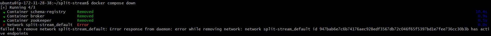

# Lab: Find distinct values in a stream of events


### Problem Statement:

How can you filter out duplicate events from a Kafka topic based on a
field in the event, producing a new stream of unique events per time
window?


### Example use case:


Consider a topic with events that represent clicks on a website. Each
event contains an IP address, a URL, and a timestamp. In this lab,
we\'ll write a program that filters click events by the IP address
within a window of time.


### Hands-on code example:


**Run it**

1. Prerequisites
2. Initialize the project
3. Get Confluent Platform
4. Write the program interactively using the CLI
5. Write your statements to a file

**Test it**

1. Create the test data
2. Invoke the tests


## Run it

## Prerequisites

This lab installs Confluent Platform using Docker. Before proceeding:

- Connect with lab environment VM using SSH:

    `ssh USERNAME@YOUR_VM_DNS.courseware.io`

  *  **Username:** Will be provided by Instructor.

  *  **Password:** Will be provided by Instructor.

- Verify that Docker is set up properly by ensuring no errors are output when you run `docker info` and `docker compose version` on the command line.


## Initialize the project


To get started, make a new directory anywhere you'd like for this
project:


```
mkdir finding-distinct && cd finding-distinct
```


Then make the following directories to set up its structure:


```
mkdir src test
```


## Get Confluent Platform


Next, create the following `docker-compose.yml` file to obtain Confluent
Platform:

```
---
version: '2'

services:
  zookeeper:
    image: confluentinc/cp-zookeeper:7.3.0
    hostname: zookeeper
    container_name: zookeeper
    ports:
      - "2181:2181"
    environment:
      ZOOKEEPER_CLIENT_PORT: 2181
      ZOOKEEPER_TICK_TIME: 2000

  broker:
    image: confluentinc/cp-kafka:7.3.0
    hostname: broker
    container_name: broker
    depends_on:
      - zookeeper
    ports:
      - "29092:29092"
    environment:
      KAFKA_BROKER_ID: 1
      KAFKA_ZOOKEEPER_CONNECT: 'zookeeper:2181'
      KAFKA_LISTENER_SECURITY_PROTOCOL_MAP: PLAINTEXT:PLAINTEXT,PLAINTEXT_HOST:PLAINTEXT
      KAFKA_ADVERTISED_LISTENERS: PLAINTEXT://broker:9092,PLAINTEXT_HOST://localhost:29092
      KAFKA_OFFSETS_TOPIC_REPLICATION_FACTOR: 1
      KAFKA_TRANSACTION_STATE_LOG_MIN_ISR: 1
      KAFKA_TRANSACTION_STATE_LOG_REPLICATION_FACTOR: 1
      KAFKA_LOG_RETENTION_MS: -1
      KAFKA_GROUP_INITIAL_REBALANCE_DELAY_MS: 0

  schema-registry:
    image: confluentinc/cp-schema-registry:7.3.0
    hostname: schema-registry
    container_name: schema-registry
    depends_on:
      - broker
    ports:
      - "8081:8081"
    environment:
      SCHEMA_REGISTRY_HOST_NAME: schema-registry
      SCHEMA_REGISTRY_KAFKASTORE_BOOTSTRAP_SERVERS: 'broker:9092'

  ksql-server:
    image: confluentinc/ksqldb-server:0.28.2
    hostname: ksql-server
    container_name: ksql-server
    depends_on:
      - broker
      - schema-registry
    ports:
      - "8088:8088"
    environment:
      KSQL_CONFIG_DIR: "/etc/ksqldb"
      KSQL_LOG4J_OPTS: "-Dlog4j.configuration=file:/etc/ksqldb/log4j.properties"
      KSQL_BOOTSTRAP_SERVERS: "broker:9092"
      KSQL_HOST_NAME: ksql-server
      KSQL_LISTENERS: "http://0.0.0.0:8088"
      KSQL_KSQL_SCHEMA_REGISTRY_URL: "http://schema-registry:8081"
      KSQL_KSQL_STREAMS_AUTO_OFFSET_RESET: "earliest"
      KSQL_KSQL_STREAMS_CACHE_MAX_BYTES_BUFFERING: 0

  ksql-cli:
    image: confluentinc/ksqldb-cli:0.28.2
    container_name: ksql-cli
    depends_on:
      - broker
      - ksql-server
    entrypoint: /bin/sh
    environment:
      KSQL_CONFIG_DIR: "/etc/ksqldb"
    tty: true
    volumes:
      - ./src:/opt/app/src
      - ./test:/opt/app/test
```


And launch it by running:


```
docker compose up -d
```


## Write the program interactively using the CLI


To begin developing interactively, open up the KSQL CLI:


```
docker exec -it ksql-cli ksql http://ksql-server:8088
```


To start off the implementation of this scenario, we will create a
stream that represents the clicks from the users. Since we will be
handling time, it is important that each click timestamp indicating when
that click was done. A bit later in the lab you'll see how to use
`ROWTIME` for that purpose.


```
CREATE STREAM CLICKS (IP_ADDRESS VARCHAR, URL VARCHAR)
    WITH (KAFKA_TOPIC = 'CLICKS',
          FORMAT = 'JSON',
          PARTITIONS = 1);
```


Now let's produce some events that represent user clicks. Note that we
are going to purposely produce duplicate events, in which each IP
address will have clicked twice in the same URL.


```
INSERT INTO CLICKS (IP_ADDRESS, URL) VALUES ('10.0.0.1', 'https://ernesto.net/');
INSERT INTO CLICKS (IP_ADDRESS, URL) VALUES ('10.0.0.12', 'https://github.com/fenago/kafka-training');
INSERT INTO CLICKS (IP_ADDRESS, URL) VALUES ('10.0.0.13', 'https://github.com/fenago/kafka-training');

INSERT INTO CLICKS (IP_ADDRESS, URL) VALUES ('10.0.0.1', 'https://ernesto.net/');
INSERT INTO CLICKS (IP_ADDRESS, URL) VALUES ('10.0.0.12', 'https://github.com/fenago/kafka-training');
INSERT INTO CLICKS (IP_ADDRESS, URL) VALUES ('10.0.0.13', 'https://github.com/fenago/kafka-training');
```


Now that you have a stream with some events in it, let's start to
leverage them. The first thing to do is set the following properties to
ensure that you're reading from the beginning of the stream:


```
SET 'auto.offset.reset' = 'earliest';
```


Next, set `cache.max.bytes.buffering` to configure the frequency of
output for tables. The value of `0` instructs ksqlDB to emit each
matching record as soon as it is processed. Without this configuration,
the queries below could appear to \"miss\" some records due to the
default batching behavior.


```
SET 'cache.max.bytes.buffering' = '0';
```


Let's experiment with these events.


First, let's create a query to select the information we need and count
each occurrence of an IP address.


```
SELECT
    IP_ADDRESS,
    COUNT(IP_ADDRESS) as IP_COUNT,
    URL,
    FORMAT_TIMESTAMP(FROM_UNIXTIME(EARLIEST_BY_OFFSET(ROWTIME)), 'yyyy-MM-dd HH:mm:ss.SSS') AS TIMESTAMP
FROM CLICKS WINDOW TUMBLING (SIZE 2 MINUTES)
GROUP BY IP_ADDRESS, URL
EMIT CHANGES
LIMIT 6;
```


And it should produce the following output:


Notice that the duplicate IP addresses have an `IP_COUNT` value greater
than one. So our next step is to filter out the duplicates by only
selecting records where the `IP_COUNT` column equals `1`.


You'll also notice that each ip-address + url combo have the same
timestamp value. That's because this this statement `EARLIEST_BY_OFFSET(ROWTIME)`
selects the earliest `ROWTIME`, the event timestamp, for the composite
key of ip-address and url. This is the desired behavior because when you
add the de-duplication, you'll only want the event timestamp of the
first user click for the unique ip-address and url pair.


Now let's create some continuous queries to implement this scenario.


```
CREATE TABLE DETECTED_CLICKS AS
    SELECT
        IP_ADDRESS AS KEY1,
        URL AS KEY2,
        AS_VALUE(IP_ADDRESS) AS IP_ADDRESS,
        COUNT(IP_ADDRESS) as IP_COUNT,
        AS_VALUE(URL) AS URL,
        FORMAT_TIMESTAMP(FROM_UNIXTIME(EARLIEST_BY_OFFSET(ROWTIME)), 'yyyy-MM-dd HH:mm:ss.SSS') AS TIMESTAMP
    FROM CLICKS WINDOW TUMBLING (SIZE 2 MINUTES, RETENTION 1000 DAYS)
    GROUP BY IP_ADDRESS, URL;

CREATE STREAM RAW_VALUES_CLICKS (IP_ADDRESS VARCHAR, IP_COUNT BIGINT, URL VARCHAR, TIMESTAMP VARCHAR)
    WITH (KAFKA_TOPIC = 'DETECTED_CLICKS',
          PARTITIONS = 1,
          FORMAT = 'JSON');

CREATE STREAM DISTINCT_CLICKS AS
    SELECT
        IP_ADDRESS,
        URL,
        TIMESTAMP
    FROM RAW_VALUES_CLICKS
    WHERE IP_COUNT = 1
    PARTITION BY IP_ADDRESS;
```


In the first statement above, we created the query that finds click
events, naming it `DETECTED_CLICKS`. We modeled it as a table since the
query performs aggregations.


As we're grouping by ip-address and url, these columns will become part
of the primary key of the table. Primary key columns are stored in the
Kafka message's key. As we'll need them in the value later, we use
`AS_VALUE` to copy the columns into the value and set their name. To
avoid the value column names clashing with the key columns, we add
aliases to rename the key columns.


As it stands, the key of the `DETECTED_CLICKS` table contains the
ip-address, and url columns, and as the table is windowed, the window
start time. Wouldn't it be nice if the key was just the IP address?
You'll take care of that as well as finding distinct IP addresses with
the next two queries.


The second statement declares a stream on top of the `DETECTED_CLICKS`
table, defining only the value columns we're interested in.


In the third statement you set the key of the `DISTINCT_CLICKS` stream
to just the IP address using the `PARTITION BY` statement. The `WHERE`
clause is where we filter out duplicates by specifying to only retrieve
IP addresses with a `IP_COUNT` of `1`.


To verify everything is working as expected, run the following query:


```
SELECT
    IP_ADDRESS,
    URL,
    TIMESTAMP
FROM DISTINCT_CLICKS
EMIT CHANGES
LIMIT 3;
```


The output should look similar to:


Finally, let's see what's available on the underlying Kafka topic for
the table. We can print that out easily.


```
PRINT DISTINCT_CLICKS FROM BEGINNING LIMIT 3;
```


The output should look similar to:


```
Key format: JSON or HOPPING(KAFKA_STRING) or TUMBLING(KAFKA_STRING) or KAFKA_STRING
Value format: JSON or KAFKA_STRING
rowtime: 2023/05/31 17:40:03.024 Z, key: "10.0.0.1", value: {"URL":"https://ernesto.net/","TIMESTAMP":"2023-05-31 17:40:03.024"}, partition: 0
rowtime: 2023/05/31 17:40:03.052 Z, key: "10.0.0.12", value: {"URL":"https://github.com/fenago/kafka-training","TIMESTAMP":"2023-05-31 17:40:03.052"}, partition: 0
rowtime: 2023/05/31 17:40:03.077 Z, key: "10.0.0.13", value: {"URL":"https://github.com/fenago/kafka-training","TIMESTAMP":"2023-05-31 17:40:03.077"}, partition: 0
Topic printing ceased
```


## Write your statements to a file

Now that you have a series of statements that's doing the right thing,
the last step is to put them into a file so that they can be used
outside the CLI session. Create a file at `src/statements.sql` with the
following content:


```
CREATE STREAM CLICKS (IP_ADDRESS STRING, URL STRING)
    WITH (KAFKA_TOPIC = 'CLICKS',
          FORMAT = 'JSON',
          PARTITIONS = 1);

CREATE TABLE DETECTED_CLICKS AS
    SELECT
        IP_ADDRESS AS KEY1,
        URL AS KEY2,
        AS_VALUE(IP_ADDRESS) AS IP_ADDRESS,
        COUNT(IP_ADDRESS) as IP_COUNT,
        AS_VALUE(URL) AS URL,
        FORMAT_TIMESTAMP(FROM_UNIXTIME(EARLIEST_BY_OFFSET(ROWTIME)), 'yyyy-MM-dd HH:mm:ss.SSS') AS TIMESTAMP
    FROM CLICKS WINDOW TUMBLING (SIZE 2 MINUTES, RETENTION 1000 DAYS)
    GROUP BY IP_ADDRESS, URL;

CREATE STREAM RAW_VALUES_CLICKS (IP_ADDRESS STRING, IP_COUNT BIGINT, URL STRING, TIMESTAMP STRING)
    WITH (KAFKA_TOPIC = 'DETECTED_CLICKS',
          PARTITIONS = 1,
          FORMAT = 'JSON');

CREATE STREAM DISTINCT_CLICKS AS
    SELECT
        IP_ADDRESS,
        URL,
        TIMESTAMP
    FROM RAW_VALUES_CLICKS
    WHERE IP_COUNT = 1
    PARTITION BY IP_ADDRESS;
```


## Test it


## Create the test data


Create a file at `test/input.json` with the inputs for testing:


```
{
  "inputs": [
    {
      "topic": "CLICKS",
      "timestamp": 1685644010383,
      "value": {
        "IP_ADDRESS": "10.0.0.1",
        "URL": "https://ernesto.net/"
      }
    },
    {
      "topic": "CLICKS",
      "timestamp": 1685644295242,
      "value": {
        "IP_ADDRESS": "10.0.0.12",
        "URL": "https://github.com/fenago/kafka-training"
      }
    },
    {
      "topic": "CLICKS",
      "timestamp": 1685644521624,
      "value": {
        "IP_ADDRESS": "10.0.0.13",
        "URL": "https://github.com/fenago/kafka-training"
      }
    },
    {
      "topic": "CLICKS",
      "timestamp": 1685644010383,
      "value": {
        "IP_ADDRESS": "10.0.0.1",
        "URL": "https://ernesto.net/"
      }
    },
    {
      "topic": "CLICKS",
      "timestamp": 1685644295242,
      "value": {
        "IP_ADDRESS": "10.0.0.12",
        "URL": "https://github.com/fenago/kafka-training"
      }
    },
    {
      "topic": "CLICKS",
      "timestamp": 1685644521624,
      "value": {
        "IP_ADDRESS": "10.0.0.13",
        "URL": "https://github.com/fenago/kafka-training"
      }
    }
  ]
}
```


Similarly, create a file at `test/output.json` with the expected
outputs.


```
{
  "outputs": [
    {
      "topic": "DISTINCT_CLICKS",
      "key": "10.0.0.1",
      "value": {
        "URL": "https://ernesto.net/",
        "TIMESTAMP": "2023-06-01 18:26:50.383"
      },
      "timestamp": 1685644010383
    },
    {
      "topic": "DISTINCT_CLICKS",
      "key": "10.0.0.12",
      "value": {
        "URL": "https://github.com/fenago/kafka-training",
        "TIMESTAMP": "2023-06-01 18:31:35.242"
      },
      "timestamp": 1685644295242
    },
    {
      "topic": "DISTINCT_CLICKS",
      "key": "10.0.0.13",
      "value": {
        "URL": "https://github.com/fenago/kafka-training",
        "TIMESTAMP": "2023-06-01 18:35:21.624"
      },
      "timestamp": 1685644521624
    }
  ]
}
```


## Invoke the tests


Lastly, invoke the tests using the test runner and the statements file
that you created earlier:


```
docker exec ksql-cli ksql-test-runner -i /opt/app/test/input.json -s /opt/app/src/statements.sql -o /opt/app/test/output.json
```


Which should pass:


```
  >>> Test passed!
```

### Cleanup Resources


Delete all the resources by running following command in the `docker-compose.yml` file directory from the terminal:

```
docker compose down

docker container prune
```



**Note:** If you get above error while running above command. Manually stop the containers and run `docker compose down` again. **Do not delete kafkanew container**.


