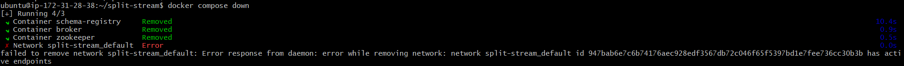
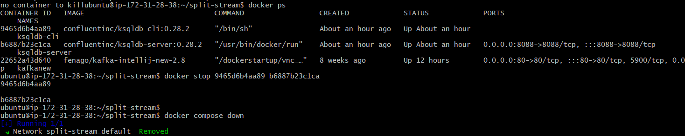

# Lab: Rekey a stream with a value


### Problem Statement:

How can you add a key or change the key to a Kafka topic?


### Example use case:


Suppose you have an unkeyed stream of movie ratings from moviegoers.
Because the stream is not keyed, ratings for the same movie aren\'t
guaranteed to be placed into the same partition. In this lab,
we\'ll write a program that creates a new topic keyed by the movie\'s
name. When the key is consistent, we can process these ratings at scale
and in parallel.


### Hands-on code example:

**Run it**

1. Prerequisites
2. Initialize the project
3. Get Confluent Platform
4. Write the program interactively using the CLI
5. Write your statements to a file

**Test it**

1. Create the test data
2. Invoke the tests


## Run it


## Prerequisites

This lab installs Confluent Platform using Docker. Before proceeding:

- Connect with lab environment VM using SSH:

    `ssh USERNAME@YOUR_VM_DNS.courseware.io`

  *  **Username:** Will be provided by Instructor.

  *  **Password:** Will be provided by Instructor.

- Verify that Docker is set up properly by ensuring no errors are output when you run `docker info` and `docker compose version` on the command line.

## Initialize the project


To get started, make a new directory anywhere you'd like for this
project:


```
mkdir rekey-a-stream && cd rekey-a-stream
```


Then make the following directories to set up its structure:


```
mkdir src test
```


## Get Confluent Platform


Next, create the following `docker-compose.yml` file to obtain Confluent
Platform:

```
---
version: '2'

services:
  zookeeper:
    image: confluentinc/cp-zookeeper:7.3.0
    hostname: zookeeper
    container_name: zookeeper
    ports:
      - "2181:2181"
    environment:
      ZOOKEEPER_CLIENT_PORT: 2181
      ZOOKEEPER_TICK_TIME: 2000

  broker:
    image: confluentinc/cp-kafka:7.3.0
    hostname: broker
    container_name: broker
    depends_on:
      - zookeeper
    ports:
      - "29092:29092"
    environment:
      KAFKA_BROKER_ID: 1
      KAFKA_ZOOKEEPER_CONNECT: 'zookeeper:2181'
      KAFKA_LISTENER_SECURITY_PROTOCOL_MAP: PLAINTEXT:PLAINTEXT,PLAINTEXT_HOST:PLAINTEXT
      KAFKA_ADVERTISED_LISTENERS: PLAINTEXT://broker:9092,PLAINTEXT_HOST://localhost:29092
      KAFKA_OFFSETS_TOPIC_REPLICATION_FACTOR: 1
      KAFKA_TRANSACTION_STATE_LOG_MIN_ISR: 1
      KAFKA_TRANSACTION_STATE_LOG_REPLICATION_FACTOR: 1
      KAFKA_GROUP_INITIAL_REBALANCE_DELAY_MS: 0

  schema-registry:
    image: confluentinc/cp-schema-registry:7.3.0
    hostname: schema-registry
    container_name: schema-registry
    depends_on:
      - broker
    ports:
      - "8081:8081"
    environment:
      SCHEMA_REGISTRY_HOST_NAME: schema-registry
      SCHEMA_REGISTRY_KAFKASTORE_BOOTSTRAP_SERVERS: 'broker:9092'

  ksqldb-server:
    image: confluentinc/ksqldb-server:0.28.2
    hostname: ksqldb-server
    container_name: ksqldb-server
    depends_on:
      - broker
      - schema-registry
    ports:
      - "8088:8088"
    environment:
      KSQL_CONFIG_DIR: "/etc/ksqldb"
      KSQL_LOG4J_OPTS: "-Dlog4j.configuration=file:/etc/ksqldb/log4j.properties"
      KSQL_BOOTSTRAP_SERVERS: "broker:9092"
      KSQL_HOST_NAME: ksqldb-server
      KSQL_LISTENERS: "http://0.0.0.0:8088"
      KSQL_CACHE_MAX_BYTES_BUFFERING: 0
      KSQL_KSQL_SCHEMA_REGISTRY_URL: "http://schema-registry:8081"

  ksqldb-cli:
    image: confluentinc/ksqldb-cli:0.28.2
    container_name: ksqldb-cli
    depends_on:
      - broker
      - ksqldb-server
    entrypoint: /bin/sh
    environment:
      KSQL_CONFIG_DIR: "/etc/ksqldb"
    tty: true
    volumes:
      - ./src:/opt/app/src
      - ./test:/opt/app/test
```


And launch it by running:


```
docker compose up -d
```


## Write the program interactively using the CLI


To begin developing interactively, open up the ksqlDB CLI:


```
docker exec -it ksqldb-cli ksql http://ksqldb-server:8088
```


First, you'll need to create a Kafka topic and stream to represent the
movie ratings data. The following creates both in one shot. Notice that
the stream has 2 partitions and no key set.


```
CREATE STREAM ratings (old INT, id INT, rating DOUBLE)
    WITH (kafka_topic='ratings',
          partitions=2,
          value_format='avro');
```


Then insert the ratings data. Because the stream has no key, the records
will be inserted in approximately a round-robin manner across the
different partitions.


```
INSERT INTO ratings (old, id, rating) VALUES (1, 294, 8.2);
INSERT INTO ratings (old, id, rating) VALUES (2, 294, 8.5);
INSERT INTO ratings (old, id, rating) VALUES (3, 354, 9.9);
INSERT INTO ratings (old, id, rating) VALUES (4, 354, 9.7);
INSERT INTO ratings (old, id, rating) VALUES (5, 782, 7.8);
INSERT INTO ratings (old, id, rating) VALUES (6, 782, 7.7);
INSERT INTO ratings (old, id, rating) VALUES (7, 128, 8.7);
INSERT INTO ratings (old, id, rating) VALUES (8, 128, 8.4);
INSERT INTO ratings (old, id, rating) VALUES (9, 780, 2.1);
```


Now that you have a stream, let's examine what key the Kafka messages
have using the `PRINT` command:


```
PRINT ratings FROM BEGINNING LIMIT 9;
```


This should yield roughly the following output. `PRINT` pulls from all
partitions of a topic. The order will be different depending on how the
records were actually inserted:


```
Key format: ¯\_(ツ)_/¯ - no data processed
Value format: AVRO
rowtime: 2022/12/02 21:56:48.720 Z, key: <null>, value: {"OLD": 2, "ID": 294, "RATING": 8.5}, partition: 0
rowtime: 2022/12/02 21:56:48.829 Z, key: <null>, value: {"OLD": 5, "ID": 782, "RATING": 7.8}, partition: 1
rowtime: 2022/12/02 21:56:48.875 Z, key: <null>, value: {"OLD": 6, "ID": 782, "RATING": 7.7}, partition: 1
rowtime: 2022/12/02 21:56:48.946 Z, key: <null>, value: {"OLD": 8, "ID": 128, "RATING": 8.4}, partition: 1
rowtime: 2022/12/02 21:56:48.652 Z, key: <null>, value: {"OLD": 1, "ID": 294, "RATING": 8.2}, partition: 1
rowtime: 2022/12/02 21:56:48.757 Z, key: <null>, value: {"OLD": 3, "ID": 354, "RATING": 9.9}, partition: 1
rowtime: 2022/12/02 21:56:48.793 Z, key: <null>, value: {"OLD": 4, "ID": 354, "RATING": 9.7}, partition: 1
rowtime: 2022/12/02 21:56:48.910 Z, key: <null>, value: {"OLD": 7, "ID": 128, "RATING": 8.7}, partition: 1
rowtime: 2022/12/02 21:56:48.982 Z, key: <null>, value: {"OLD": 9, "ID": 780, "RATING": 2.1}, partition: 1
Topic printing ceased
```


Note that the key is `null` for every message. This means that ratings
data for the same movie could be spread across multiple partitions. This
is generally not good for scalability when you care about having the
same \"kind\" of data in a single partition.


Let's fix that. Using KSQL's appropriately named `PARTITION BY` clause
we can apply a key to the messages and write it to a new stream. Here
we'll use the movie identifier, `ID`.


First we tell ksqlDB to query data from the beginning of the topic:


```
SET 'auto.offset.reset' = 'earliest';
```


Then, issue the following to create a new stream that is continuously
populated by its query:


```
CREATE STREAM RATINGS_REKEYED
    WITH (KAFKA_TOPIC='ratings_keyed_by_id') AS
    SELECT *
    FROM RATINGS
    PARTITION BY ID;
```


To check that it's working, let's first describe the new stream:


```
DESCRIBE RATINGS_REKEYED;
```


Your output should resemble:


```
Name                 : RATINGS_REKEYED
 Field  | Type

 ID     | INTEGER          (key)
 OLD    | INTEGER
 RATING | DOUBLE

For runtime statistics and query details run: DESCRIBE <Stream,Table> EXTENDED;
```


Note the `(key)` at the end of the `ID` row that indicates the column is
now stored in the Kafka message's key.


Next, we can print out the contents of the output stream's underlying
topic to ensure the key has been correctly set.


```
PRINT ratings_keyed_by_id FROM BEGINNING LIMIT 9;
```


This should yield the roughly the following output:


```
Key format: KAFKA_INT
Value format: AVRO
rowtime: 2020/05/04 23:24:30.376 Z, key: 128, value: {"OLD": 8, "RATING": 8.4}, partition: 0
rowtime: 2020/05/04 23:24:30.684 Z, key: 128, value: {"OLD": 7, "RATING": 8.7}, partition: 0
rowtime: 2020/05/04 23:24:30.781 Z, key: 294, value: {"OLD": 1, "RATING": 8.2}, partition: 0
rowtime: 2020/05/04 23:24:30.949 Z, key: 294, value: {"OLD": 2, "RATING": 8.5}, partition: 0
rowtime: 2020/05/04 23:24:31.099 Z, key: 354, value: {"OLD": 4, "RATING": 9.7}, partition: 0
rowtime: 2020/05/04 23:24:30.560 Z, key: 354, value: {"OLD": 3, "RATING": 9.9}, partition: 0
rowtime: 2020/05/04 23:24:30.873 Z, key: 780, value: {"OLD": 9, "RATING": 2.1}, partition: 1
rowtime: 2020/05/04 23:24:31.021 Z, key: 782, value: {"OLD": 6, "RATING": 7.7}, partition: 0
rowtime: 2020/05/04 23:24:31.178 Z, key: 782, value: {"OLD": 5, "RATING": 7.8}, partition: 0
Topic printing ceased
```


As you can see, the key format is now `KAFKA_INT` and the `ID` column in
each row has been removed from the `value` and into the `key`, meaning
the data has be repartitioned such that all movies with the same ID are
now in exactly one partition.


## Write your statements to a file


Now that you have a series of statements that's doing the right thing,
the last step is to put them into a file so that they can be used
outside the CLI session. Create a file at `src/statements.sql` with the
following content:


```
CREATE STREAM ratings (old INT, id INT, rating DOUBLE)
    WITH (kafka_topic='ratings',
          partitions=2,
          value_format='avro');

CREATE STREAM RATINGS_REKEYED
  WITH (KAFKA_TOPIC='ratings_keyed_by_id') AS
    SELECT *
    FROM RATINGS
    PARTITION BY ID;
```

## Test it


## Create the test data

Create a file at `test/input.json` with the inputs for testing:


```
{
  "inputs": [
    {
      "topic": "ratings",
      "value": {
        "old": 1,
        "id": 294,
        "rating": 8.2
      }
    },
    {
      "topic": "ratings",
      "value": {
        "old": 2,
        "id": 294,
        "rating": 8.5
      }
    },
    {
      "topic": "ratings",
      "value": {
        "old": 3,
        "id": 354,
        "rating": 9.9
      }
    },
    {
      "topic": "ratings",
      "value": {
        "old": 4,
        "id": 354,
        "rating": 9.7
      }
    },
    {
      "topic": "ratings",
      "value": {
        "old": 5,
        "id": 782,
        "rating": 7.8
      }
    },
    {
      "topic": "ratings",
      "value": {
        "old": 6,
        "id": 782,
        "rating": 7.7
      }
    },
    {
      "topic": "ratings",
      "value": {
        "old": 7,
        "id": 128,
        "rating": 8.7
      }
    },
    {
      "topic": "ratings",
      "value": {
        "old": 8,
        "id": 128,
        "rating": 8.4
      }
    },
    {
      "topic": "ratings",
      "value": {
        "old": 9,
        "id": 780,
        "rating": 2.1
      }
    }
  ]
}
```


Similarly, create a file at `test/output.json` with the expected
outputs:


```
{
  "outputs": [
    {
      "topic": "ratings_keyed_by_id",
      "key": 294,
      "value": {
        "RATING": 8.2,
        "OLD": 1
      }
    },
    {
      "topic": "ratings_keyed_by_id",
      "key": 294,
      "value": {
        "RATING": 8.5,
        "OLD": 2
      }
    },
    {
      "topic": "ratings_keyed_by_id",
      "key": 354,
      "value": {
        "RATING": 9.9,
        "OLD": 3
      }
    },
    {
      "topic": "ratings_keyed_by_id",
      "key": 354,
      "value": {
        "RATING": 9.7,
        "OLD": 4
      }
    },
    {
      "topic": "ratings_keyed_by_id",
      "key": 782,
      "value": {
        "RATING": 7.8,
        "OLD": 5
      }
    },
    {
      "topic": "ratings_keyed_by_id",
      "key": 782,
      "value": {
        "RATING": 7.7,
        "OLD": 6
      }
    },
    {
      "topic": "ratings_keyed_by_id",
      "key": 128,
      "value": {
        "RATING": 8.7,
        "OLD": 7
      }
    },
    {
      "topic": "ratings_keyed_by_id",
      "key": 128,
      "value": {
        "RATING": 8.4,
        "OLD": 8
      }
    },
    {
      "topic": "ratings_keyed_by_id",
      "key": 780,
      "value": {
        "RATING": 2.1,
        "OLD": 9
      }
    }
  ]
}
```


## Invoke the tests

Lastly, invoke the tests using the test runner and the statements file
that you created earlier:


```
docker exec ksqldb-cli ksql-test-runner -i /opt/app/test/input.json -s /opt/app/src/statements.sql -o /opt/app/test/output.json
```


Which should pass:


```
  >>> Test passed!
```


### Cleanup Resources


Delete all the resources by running following command in the `docker-compose.yml` file directory from the terminal:

```
docker compose down

docker container prune
```



**Note:** If you get above error while running above command. Manually stop the containers and run `docker compose down` again. **Do not delete kafkanew container**.


