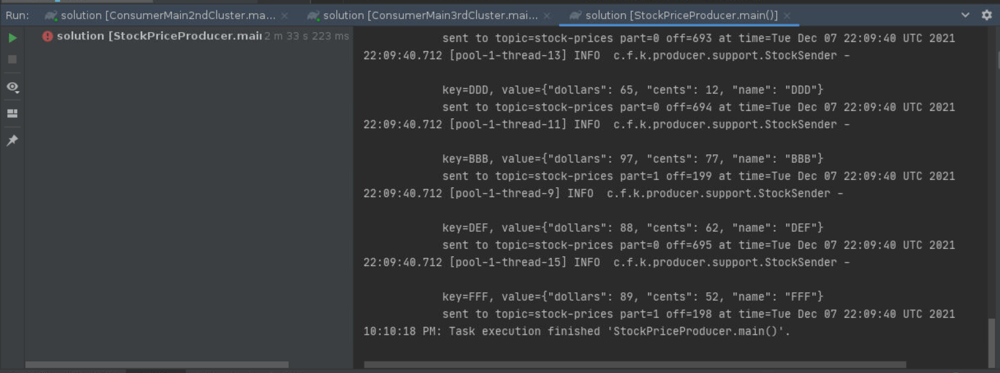

# Lab 9: Kafka MirrorMaker

Welcome to the session 9 lab. The work for this lab is done in `~/kafka-training/labs/lab9`.
In this lab, you are going to set up Kafka MirrorMaker.

<h4>Important!</h4>

Run following script first to stop any running kafka/zookeeper process and clear logs.

`~/kafka-training/kill-clean.sh`

**Note:** Lab solution is available in following directory:
`~/kafka-training/labs/lab9/solution`

## Kafka MirrorMaker

Mirroring is replication between clusters. It is called mirroring to not confuse with it
with replication. Mirroring is just a consumer/producer pair in two clusters.
Mirroring is done my MirrorMaker.

Mirroring gets used for disaster recovery. If a datacenter or region goes down, a hot
standby cluster can be used. Conversely, Kafka cluster replication is used for normal
fault-tolerance.
You could keep a replica cluster in another datacenter or AWS region for disaster recovery.
You can also use mirroring for increased throughput for reads. Mirroring could allow you
to scale Kafka consumers and take pressure off a critical Kafka cluster that is used
for microservices operational messaging.

## Lab Objectives

* Show running MirrorMaker to mirror a Kafka Cluster to another Kafka Cluster.
* Show how topics can be configured differently per Cluster
* Demonstrate how to run MirrorMaker
* Demonstrate how to configure MirrorMakers Consumer
* Demonstrate how to configure MirrorMakers Producer

Use the slides as a guide for this lab.

## Create scripts to start up three clusters

Each script will start one ZooKeeper and one broker.
Each broker will run in its own cluster.

***ACTION*** EDIT bin/start-1st-cluster.sh and follow instructions in file

***ACTION*** EDIT bin/start-2nd-cluster.sh and follow instructions in file

***ACTION*** EDIT bin/start-3rd-cluster.sh and follow instructions in file

## Modify ZooKeeper to run on its own ports

Each ZooKeeper instance runs on its own port and is independent of the others.

***ACTION*** - EDIT bin/zookeeper-0.properties and follow instructions in file

***ACTION*** - EDIT bin/zookeeper-1.properties and follow instructions in file

***ACTION*** - EDIT bin/zookeeper-2.properties and follow instructions in file

## Modify Broker config to point to different ZooKeepers
Also setup different partition sizes and disable auto create for cluster 0.

***ACTION*** - EDIT config/server-0.properties and follow instructions in file

***ACTION*** - EDIT config/server-1.properties and follow instructions in file

***ACTION*** - EDIT config/server-2.properties and follow instructions in file

## Create Two Mirror Maker Config Files for Consumers

***ACTION*** - EDIT config/mm-consumer-1st.properties and follow instructions in file

***ACTION*** - EDIT config/mm-consumer-2nd.properties and follow instructions in file

## Create Two Mirror Maker Config Files for Producers

***ACTION*** - EDIT config/mm-producer-2nd.properties and follow instructions in file

***ACTION*** - EDIT config/mm-producer-3rd.properties and follow instructions in file

## Create Two MirrorMaker Start Scripts

***ACTION*** - EDIT bin/start-mirror-maker-1st-to-2nd.sh and follow instructions in file

***ACTION*** - EDIT bin/start-mirror-maker-2nd-to-3rd.sh and follow instructions in file

## Run it

All scripts should be run from following directory:
`cd ~/kafka-training/labs/lab9/solution`

***ACTION*** - START - Start up first cluster: bin/start-1st-cluster.sh

***ACTION*** - START - In a new terminal, Start up 2nd cluster: bin/start-2nd-cluster.sh

***ACTION*** - START - In a new terminal, Start up 3rd cluster: bin/start-3rd-cluster.sh

***ACTION*** - WAIT - Wait 30 seconds

***ACTION*** - CREATE - Create Topic: bin/create-topic.sh

***ACTION*** - START - In a new terminal, start up MirrorMaker for 1st to 2nd mirroring - bin/start-mirror-maker-1st-to-2nd.sh

***ACTION*** - START - In a new terminal, start up Mirror Maker for 2nd to 3rd mirroring - bin/start-mirror-maker-2nd-to-3rd.sh

***ACTION*** - RUN - Run ConsumerMain1stCluster in IDE

***ACTION*** - RUN - Run ConsumerMain2ndCluster in IDE

***ACTION*** - RUN - Run ConsumerMain3rdCluster in IDE

***ACTION*** - RUN - Run StockPriceProducer in IDE and wait for console to start generate logs like this:

***ACTION*** - WAIT - After 30 Seconds stop StockPriceProducer

***ACTION*** - WAIT - Wait 30 seconds and ensure consumers have same stock prices

## Expected results
You should be able to send records from the producer to the broker and this data
get replicated to the other servers.
The consumers should have the same stock prices in their console.
