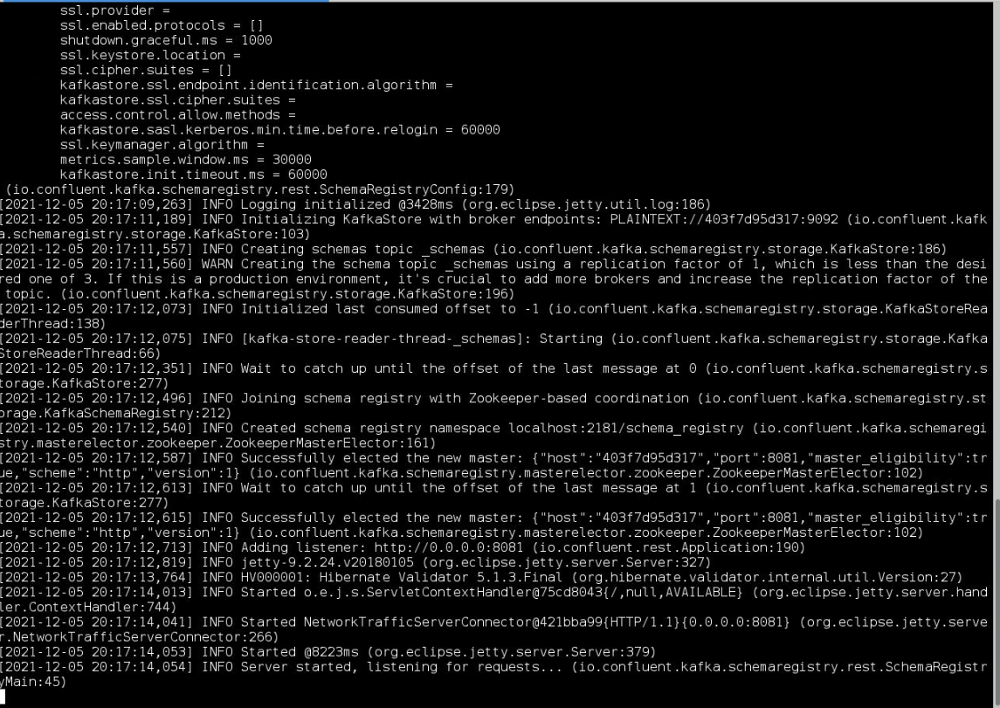
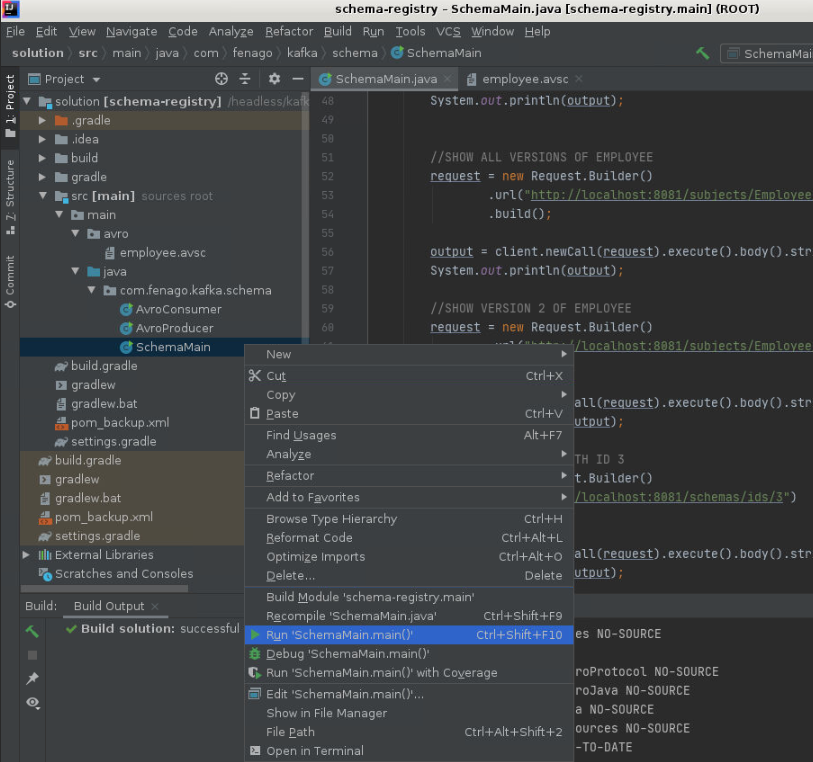
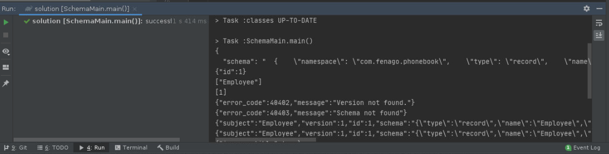
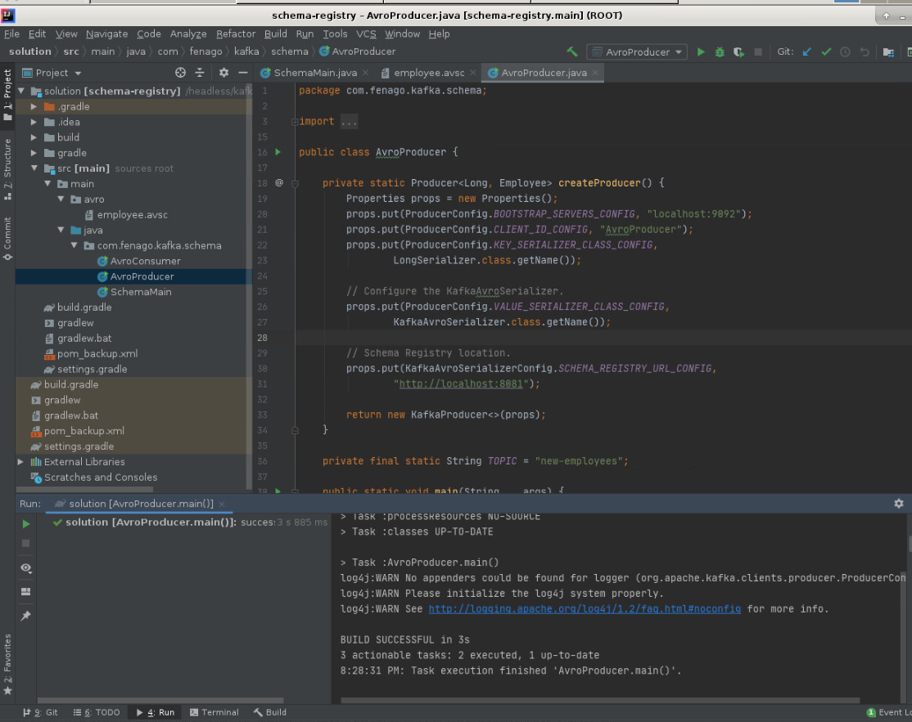
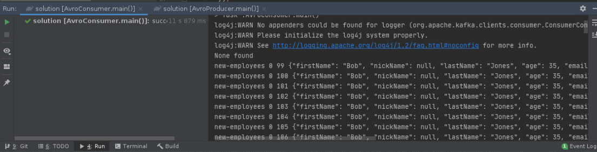
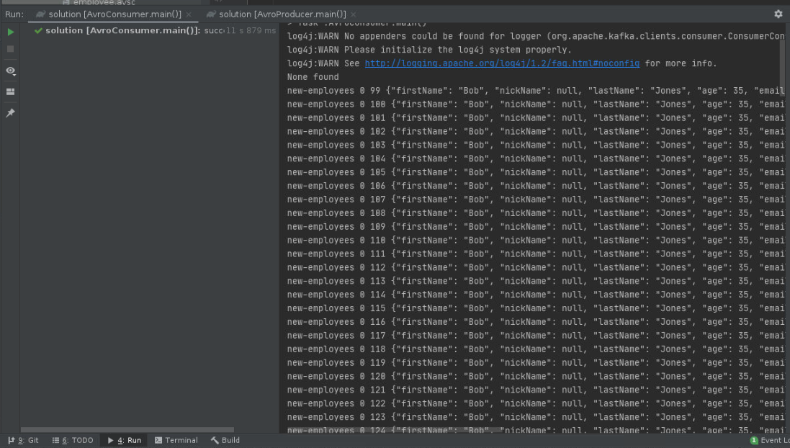

# Lab 7.2: Kafka Schema Registry with Avro.

Welcome to the session 7 lab 2. The work for this lab is done in `~/kafka-training/labs/lab7.2`.
In this lab, you are going to use the Schema Registry with Avro.

## Kafka Lab: Kafka, Avro Serialization and the Schema Registry

Confluent Schema Registry stores Avro Schemas
for Kafka producers and consumers. The Schema Registry and provides RESTful interface for
managing Avro schemas It allows the storage of a history of schemas which are versioned.
the ***Confluent Schema Registry*** supports checking schema compatibility for Kafka.
You can configure compatibility setting which supports the evolution of schemas using Avro.
Kafka Avro serialization project provides serializers. Kafka Producers and Consumers that
use Kafka Avro serialization handle schema management and serialization of records using
Avro and the Schema Registry. When using the ***Confluent Schema Registry***,  Producers
don’t have to send schema just the schema id which is unique. The consumer uses the
schema id to look up the full schema from the ***Confluent Schema Registry*** if not
already cached.  Since you don't have to send the schema with each set of records,
this saves time. Not sending the schema with each record or batch of records, speeds up
the serialization as only the id of the schema is sent.


This lab is going to cover what is the Schema Registry and cover why you want to use it
with Kafka. We drill down into understanding Avro *schema evolution* and setting up and
using Schema Registry with Kafka Avro Serializers. We show how to manage Avro Schemas with
REST interface of the Schema Registry and then how to write Avro Serializer based Producers
and Avro Deserializer based Consumers for Kafka.

The Kafka Producer creates a record/message, which is an Avro record. The record contains a
schema id and data. With Kafka Avro Serializer, the schema is registered if needed and then
it serializes the data and schema id. The Kafka Avro Serializer keeps a cache of registered
schemas from Schema Registry their schema ids.

Consumers receive payloads and deserialize them with Kafka  Avro Deserializers which use the
Confluent Schema Registry. Deserializer looks up the full schema from cache or Schema Registry
based on id.


### Schema Evolution
If an Avro schema is changed after data has been written to store using an older version of that schema,
 then Avro might do a Schema Evolution when you try to read that data.

From Kafka perspective, Schema evolution happens only during deserialization at Consumer (read).  If
Consumer’s schema is different from Producer’s schema, then value or key is automatically modified
during deserialization to conform to consumers reader schema if possible.

Avro *schema evolution* is an automatic transformation of Avro schema between the consumer schema
version and what the schema the producer put into the Kafka log.
When Consumer schema is not identical to the Producer schema used to serialize the Kafka Record, then
a data transformation is performed on the Kafka record's key or value. If the schemas match then
no need to do a transformation

### Allowed Modification During Schema Evolution
You can add a field with a default to a schema. You can remove a field that had a default value. You can
change a field's order attribute.  You can change a field's default value to another value or add a
default value to a field that did not have one.
You can remove or add a field alias (keep in mind that this could break some consumers that depend
on the alias).  You can change a type to a union that contains original type. If you do any of the
above, then your schema can use Avro's schema evolution when reading with an old schema.

### Rules of the Road for modifying Schema
If you want to make your schema evolvable, then follow these guidelines. Provide a default value for
fields in your schema as this allows you to delete the field later. Never change a field's data type.
When adding a new field to your schema, you have to provide a default value for the field.
Don’t rename an existing field (use aliases instead). You can add an alias.

Let's use an example to talk about this. The following example is from our
`Avro tutorial`.

#### Employee example Avro Schema

```javascript
{"namespace": "com.fenago.phonebook",
  "type": "record",
  "name": "Employee",
  "doc" : "Represents an Employee at a company",
  "fields": [
    {"name": "firstName", "type": "string", "doc": "The persons given name"},
    {"name": "nickName", "type": ["null", "string"], "default" : null},
    {"name": "lastName", "type": "string"},
    {"name": "age",  "type": "int", "default": -1},
    {"name": "emails", "default":[], "type":{"type": "array", "items": "string"}},
    {"name": "phoneNumber",  "type":
    [ "null",
      { "type": "record",   "name": "PhoneNumber",
        "fields": [
          {"name": "areaCode", "type": "string"},
          {"name": "countryCode", "type": "string", "default" : ""},
          {"name": "prefix", "type": "string"},
          {"name": "number", "type": "string"}
        ]
      }
    ]
    },
    {"name":"status", "default" :"SALARY", "type": { "type": "enum", "name": "Status",
      "symbols" : ["RETIRED", "SALARY", "HOURLY", "PART_TIME"]}
    }
  ]
}
```

#### Avro Schema Evolution Scenario

Let's say our `Employee` record did not have an `age` in version 1 of the schema and then later
we decided to add an `age` field with a default value of -1. Now let’s say we have a Producer
using version 2  of the schema with age, and a Consumer using version 1 with no age.

The `Producer` uses version 2 of the `Employee` schema and creates a `com.fenago.Employee` record,
and sets `age` field to `42`, then sends it to Kafka topic `new-employees`.
The Consumer consumes records from `new-employees` using version 1 of the Employee Schema.
Since Consumer is using version 1 of the schema, the `age` field gets removed during deserialization.

The same consumer modifies some records and then writes the record to a NoSQL store. When the Consumer
does this, the `age` field is missing from the record that it writes to the NoSQL store.
Another client using version 2 of the schema which has the age, reads the record from the NoSQL store.
The `age` field is missing from the record because the Consumer wrote it with version 1, thus the client
reads the record and the `age` is set to default value of `-1`.

If you added the `age` and it was not optional, i.e., the `age` field did not have a default, then the
Schema Registry could reject the schema, and the Producer could never it add it to the Kafka log.


## Using REST Schema Registry REST API

Recall that the Schema Registry allows you to manage schemas using the following operations:

* store schemas for keys and values of Kafka records
* List schemas by subject.
* list all versions of a subject (schema).
* Retrieves a schema by version
* Retrieves a schema by id
* Retrieve the latest version of a schema
* Perform compatibility checks
* Set compatibility level globally
* Set compatibility level globally

Recall that all of this is available via a REST API with the Schema Registry.

#### To list all of the schemas

```sh
curl -X GET http://localhost:8081/subjects
```

If you have a good HTTP client, you can basically perform all of the above operations via the REST
interface for the Schema Registry. Let's use following example to understand the
Schema registry a little better using the OkHttp client from Square (`com.squareup.okhttp3:okhttp:3.7.0+`) as follows:

#### Using REST endpoints to try out all of the Schema Registry options
```
package com.fenago.kafka.schema;

import okhttp3.*;

import java.io.IOException;

public class SchemaMain {

    private final static MediaType SCHEMA_CONTENT =
            MediaType.parse("application/vnd.schemaregistry.v1+json");

    private final static String EMPLOYEE_SCHEMA = "{\n" +
            "  \"schema\": \"" +
            "  {" +
            "    \\\"namespace\\\": \\\"com.fenago.phonebook\\\"," +
            "    \\\"type\\\": \\\"record\\\"," +
            "    \\\"name\\\": \\\"Employee\\\"," +
            "    \\\"fields\\\": [" +
            "        {\\\"name\\\": \\\"fName\\\", \\\"type\\\": \\\"string\\\"}," +
            "        {\\\"name\\\": \\\"lName\\\", \\\"type\\\": \\\"string\\\"}," +
            "        {\\\"name\\\": \\\"age\\\",  \\\"type\\\": \\\"int\\\"}," +
            "        {\\\"name\\\": \\\"phoneNumber\\\",  \\\"type\\\": \\\"string\\\"}" +
            "    ]" +
            "  }\"" +
            "}";

    public static void main(String... args) throws IOException {

        System.out.println(EMPLOYEE_SCHEMA);

        final OkHttpClient client = new OkHttpClient();

        //POST A NEW SCHEMA
        Request request = new Request.Builder()
                .post(RequestBody.create(SCHEMA_CONTENT, EMPLOYEE_SCHEMA))
                .url("http://localhost:8081/subjects/Employee/versions")
                .build();

        String output = client.newCall(request).execute().body().string();
        System.out.println(output);

        //LIST ALL SCHEMAS
        request = new Request.Builder()
                .url("http://localhost:8081/subjects")
                .build();

        output = client.newCall(request).execute().body().string();
        System.out.println(output);


        //SHOW ALL VERSIONS OF EMPLOYEE
        request = new Request.Builder()
                .url("http://localhost:8081/subjects/Employee/versions/")
                .build();

        output = client.newCall(request).execute().body().string();
        System.out.println(output);

        //SHOW VERSION 2 OF EMPLOYEE
        request = new Request.Builder()
                .url("http://localhost:8081/subjects/Employee/versions/2")
                .build();

        output = client.newCall(request).execute().body().string();
        System.out.println(output);

        //SHOW THE SCHEMA WITH ID 3
        request = new Request.Builder()
                .url("http://localhost:8081/schemas/ids/3")
                .build();

        output = client.newCall(request).execute().body().string();
        System.out.println(output);


        //SHOW THE LATEST VERSION OF EMPLOYEE 2
        request = new Request.Builder()
                .url("http://localhost:8081/subjects/Employee/versions/latest")
                .build();

        output = client.newCall(request).execute().body().string();
        System.out.println(output);


        //CHECK IF SCHEMA IS REGISTERED
        request = new Request.Builder()
                .post(RequestBody.create(SCHEMA_CONTENT, EMPLOYEE_SCHEMA))
                .url("http://localhost:8081/subjects/Employee")
                .build();

        output = client.newCall(request).execute().body().string();
        System.out.println(output);


        //TEST COMPATIBILITY
        request = new Request.Builder()
                .post(RequestBody.create(SCHEMA_CONTENT, EMPLOYEE_SCHEMA))
                .url("http://localhost:8081/compatibility/subjects/Employee/versions/latest")
                .build();

        output = client.newCall(request).execute().body().string();
        System.out.println(output);

        // TOP LEVEL CONFIG
        request = new Request.Builder()
                .url("http://localhost:8081/config")
                .build();

        output = client.newCall(request).execute().body().string();
        System.out.println(output);


        // SET TOP LEVEL CONFIG
        // VALUES are none, backward, forward and full
        request = new Request.Builder()
                .put(RequestBody.create(SCHEMA_CONTENT, "{\"compatibility\": \"none\"}"))
                .url("http://localhost:8081/config")
                .build();

        output = client.newCall(request).execute().body().string();
        System.out.println(output);

        // SET CONFIG FOR EMPLOYEE
        // VALUES are none, backward, forward and full
        request = new Request.Builder()
                .put(RequestBody.create(SCHEMA_CONTENT, "{\"compatibility\": \"backward\"}"))
                .url("http://localhost:8081/config/Employee")
                .build();

        output = client.newCall(request).execute().body().string();
        System.out.println(output);


    }
}

```

I suggest running the example and trying to force incompatible schemas to the Schema Registry and
note the behavior for the various compatibility settings.

#### Running Schema Registry

```
$ cat ~/kafka-training/confluent/etc/schema-registry/schema-registry.properties

listeners=http://0.0.0.0:8081
kafkastore.connection.url=localhost:2181
kafkastore.topic=_schemas
debug=false
```

<span style="color:red;">Note:</span> 
Run following command in the terminal to start schema registry:

```
~/kafka-training/confluent/bin/schema-registry-start  ~/kafka-training/confluent/etc/schema-registry/schema-registry.properties
```


***ACTION*** - RUN the schema registry on port 8081


***ACTION*** - EDIT SchemaMain and follow the instructions in the file.

***ACTION*** - RUN SchemaMain from the IDE.




***ACTION*** - TRY Add extra fields and then check compatibility

## Writing Consumers and Producers that use Kafka Avro Serializers and the Schema Registry

Now let's cover writing consumers and producers that use Kafka Avro Serializers which in turn use
the Schema Registry and Avro.

We will need to start up the Schema Registry server pointing to our Zookeeper cluster.
Then we will need to import the Kafka Avro Serializer and Avro Jars into our gradle project.
You will then need to configure the Producer to use Schema Registry and the `KafkaAvroSerializer`.
To write the consumer, you will need to configure it to use Schema Registry
and to use the KafkaAvroDeserializer.


Here is our build file which shows the Avro jar files and such that we need.

#### Gradle build file for Kafka Avro Serializer

```
plugins {
    id "com.commercehub.gradle.plugin.avro" version "0.9.0"
}

group 'fenago'
version '1.0-SNAPSHOT'
apply plugin: 'java'
sourceCompatibility = 1.8

dependencies {
    compile "org.apache.avro:avro:1.8.2"
    compile 'com.squareup.okhttp3:okhttp:3.7.0'
    testCompile 'junit:junit:4.11'
    compile 'org.apache.kafka:kafka-clients:1.1.0'
    compile 'io.confluent:kafka-avro-serializer:3.3.0'
}
repositories {
    jcenter()
    mavenCentral()
    maven {
        url "http://packages.confluent.io/maven/"
    }
}
avro {
    createSetters = false
    fieldVisibility = "PRIVATE"
}

wrapper {
    gradleVersion = "4.7"
}

sourceSets{
    main {
        java {
            srcDir 'src'
            srcDir 'build/generated-main-avro-java'
        }
    }
}
```


***ACTION*** - MODIFY build.gradle and save it.

Notice that we include the Kafka Avro Serializer lib (`io.confluent:kafka-avro-serializer:3.3.0`)
and the Avro lib (`org.apache.avro:avro:1.8.2`).

### Writing a Producer

Next, let's write the Producer as follows.

#### Producer that uses Kafka Avro Serialization and Kafka Registry
#### src/main/java/com/fenago/kafka/schema/AvroProducer.java

```java
package com.fenago.kafka.schema;

import com.fenago.phonebook.Employee;
import com.fenago.phonebook.PhoneNumber;
import io.confluent.kafka.serializers.KafkaAvroSerializerConfig;
import org.apache.kafka.clients.producer.KafkaProducer;
import org.apache.kafka.clients.producer.Producer;
import org.apache.kafka.clients.producer.ProducerConfig;
import org.apache.kafka.clients.producer.ProducerRecord;
import org.apache.kafka.common.serialization.LongSerializer;
import io.confluent.kafka.serializers.KafkaAvroSerializer;

import java.util.Properties;
import java.util.stream.IntStream;

public class AvroProducer {

    private static Producer<Long, Employee> createProducer() {
        Properties props = new Properties();
        props.put(ProducerConfig.BOOTSTRAP_SERVERS_CONFIG, "localhost:9092");
        props.put(ProducerConfig.CLIENT_ID_CONFIG, "AvroProducer");
        props.put(ProducerConfig.KEY_SERIALIZER_CLASS_CONFIG,
                LongSerializer.class.getName());

        // Configure the KafkaAvroSerializer.
       props.put(ProducerConfig.VALUE_SERIALIZER_CLASS_CONFIG,
                KafkaAvroSerializer.class.getName());

        // Schema Registry location.
        props.put(KafkaAvroSerializerConfig.SCHEMA_REGISTRY_URL_CONFIG,
                "http://localhost:8081");

        return new KafkaProducer<>(props);
    }

    private final static String TOPIC = "new-employees";

    public static void main(String... args) {

        Producer<Long, Employee> producer = createProducer();

        Employee bob = Employee.newBuilder().setAge(35)
                .setFirstName("Bob")
                .setLastName("Jones")
                .setPhoneNumber(
                        PhoneNumber.newBuilder()
                                .setAreaCode("301")
                                .setCountryCode("1")
                                .setPrefix("555")
                                .setNumber("1234")
                                .build())
                .build();

        IntStream.range(1, 100).forEach(index->{
            producer.send(new ProducerRecord<>(TOPIC, 1L * index, bob));

        });

        producer.flush();
        producer.close();
    }

}

```

Notice that we configure the schema registry and the KafkaAvroSerializer as part of the Producer setup.

```java
// Configure the KafkaAvroSerializer.
props.put(ProducerConfig.VALUE_SERIALIZER_CLASS_CONFIG,
                KafkaAvroSerializer.class.getName());

// Schema Registry location.        props.put(KafkaAvroSerializerConfig.SCHEMA_REGISTRY_URL_CONFIG,
                "http://localhost:8081");

```

Then we use the Producer as expected.


***ACTION*** - Edit AvroProducer and follow instructions in the file.

### AvroConsumer

### Writing a Consumer

Next we have to write the Consumer.

#### Consumer that uses Kafka Avro Serialization and Schema Registry
#### src/main/java/com/fenago/kafka/schema/AvroConsumer.java
```java
package com.fenago.kafka.schema;

import com.fenago.phonebook.Employee;
import io.confluent.kafka.serializers.KafkaAvroDeserializer;
import io.confluent.kafka.serializers.KafkaAvroDeserializerConfig;
import org.apache.kafka.clients.consumer.Consumer;
import org.apache.kafka.clients.consumer.ConsumerConfig;
import org.apache.kafka.clients.consumer.ConsumerRecords;
import org.apache.kafka.clients.consumer.KafkaConsumer;
import org.apache.kafka.common.serialization.LongDeserializer;

import java.util.Collections;
import java.util.Properties;
import java.util.stream.IntStream;

public class AvroConsumer {

    private final static String BOOTSTRAP_SERVERS = "localhost:9092";
    private final static String TOPIC = "new-employees";

    private static Consumer<Long, Employee> createConsumer() {
        Properties props = new Properties();
        props.put(ConsumerConfig.BOOTSTRAP_SERVERS_CONFIG, BOOTSTRAP_SERVERS);
        props.put(ConsumerConfig.GROUP_ID_CONFIG, "KafkaExampleAvroConsumer");
        props.put(ConsumerConfig.KEY_DESERIALIZER_CLASS_CONFIG,
                LongDeserializer.class.getName());

        //Use Kafka Avro Deserializer.
        props.put(ConsumerConfig.VALUE_DESERIALIZER_CLASS_CONFIG,
                KafkaAvroDeserializer.class.getName());  //<----------------------

        //Use Specific Record or else you get Avro GenericRecord.
        props.put(KafkaAvroDeserializerConfig.SPECIFIC_AVRO_READER_CONFIG, "true");


        //Schema registry location.
        props.put(KafkaAvroDeserializerConfig.SCHEMA_REGISTRY_URL_CONFIG,
                "http://localhost:8081"); //<----- Run Schema Registry on 8081


        return new KafkaConsumer<>(props);
    }


    public static void main(String... args) {

        final Consumer<Long, Employee> consumer = createConsumer();
        consumer.subscribe(Collections.singletonList(TOPIC));

        IntStream.range(1, 100).forEach(index -> {

            final ConsumerRecords<Long, Employee> records =
                    consumer.poll(100);

            if (records.count() == 0) {
                System.out.println("None found");
            } else records.forEach(record -> {

                Employee employeeRecord = record.value();

                System.out.printf("%s %d %d %s \n", record.topic(),
                        record.partition(), record.offset(), employeeRecord);
            });
        });
    }


}

```


Notice just like the producer we have to tell the consumer where to find the Registry, and we have
to configure the Kafka Avro Deserializer.

#### Configuring Schema Registry for Consumer
```
//Use Kafka Avro Deserializer.

props.put(ConsumerConfig.VALUE_DESERIALIZER_CLASS_CONFIG,
                KafkaAvroDeserializer.class.getName());

//Use Specific Record or else you get Avro GenericRecord.
props.put(KafkaAvroDeserializerConfig.SPECIFIC_AVRO_READER_CONFIG, "true");

//Schema registry location.        props.put(KafkaAvroDeserializerConfig.SCHEMA_REGISTRY_URL_CONFIG,
                "http://localhost:8081"); //<----- Run Schema Registry on 8081
```


***ACTION*** - Edit AvroConsumer and follow instructions in the file.

An additional step is we have to tell it to use the generated version of the `Employee` object.
If we did not, then it would use Avro `GenericRecord` instead of our generated `Employee` object,
which is a `SpecificRecord`.  To learn more about using GenericRecord and generating code from Avro, read the Avro Kafka tutorial

To run the above example, you need to startup Kafka and Zookeeper.

#### Running Zookeeper and Kafka

**Terminal 1:**

`~/kafka-training/run-zookeeper.sh`

**Terminal 2:**

`~/kafka-training/run-kafka.sh`

***ACTION*** - RUN ZooKeeper and a Kafka Broker

Make sure schema registry is running as well.

***ACTION*** - RUN AvroProducer from the IDE




***ACTION*** - RUN AvroConsumer from the IDE


**ProTip** Scroll up to view complete consumer output.

## Expected results.
The consumer gets messages from the Kafka broker that was sent by the producer.

You can stop kafka, zookeeper and schema registry now.

## Conclusion

Confluent provides Schema Registry to manage Avro Schemas for Kafka Consumers and Producers.
Avro provides Schema Migration which is necessary for streaming and big data architectures.
Confluent uses Schema compatibility checks to see if the Producer's schema and Consumer's schemas
are compatible and to do Schema evolution if needed.
You use KafkaAvroSerializer from the Producer and point to the Schema Registry.
You use KafkaAvroDeserializer from Consumer and point to the Schema Registry.

<br />
