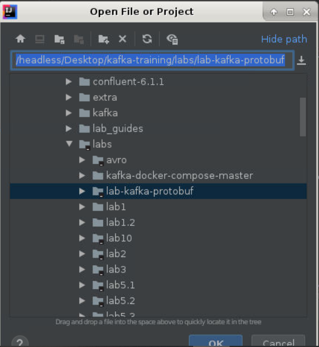
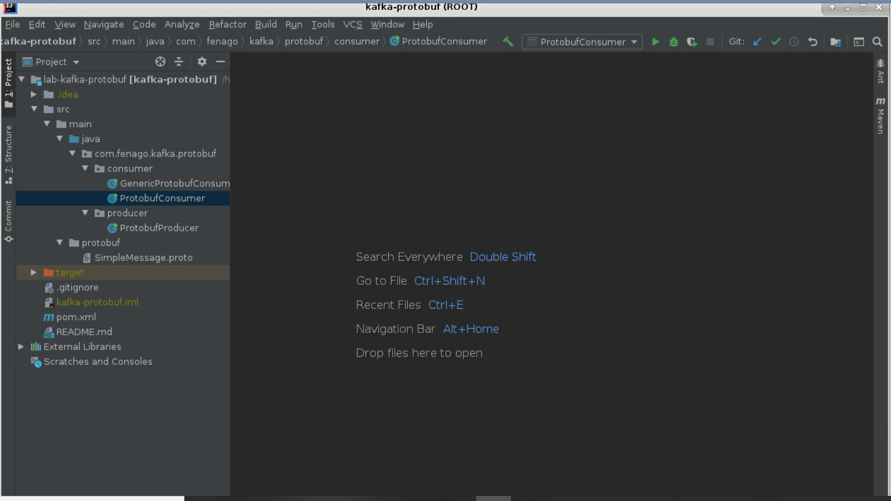
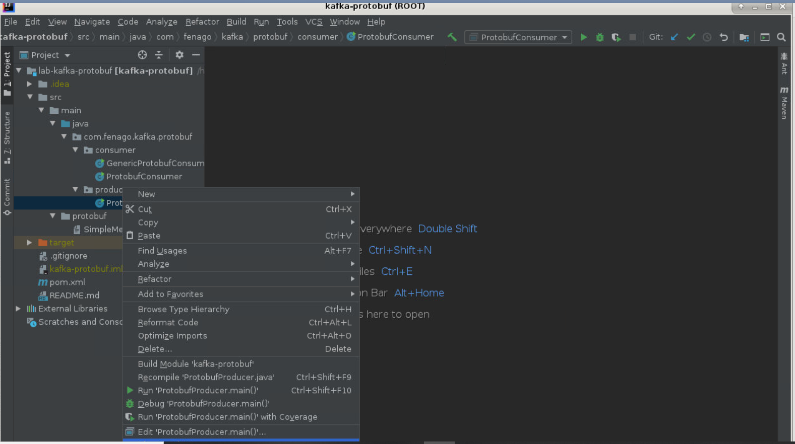
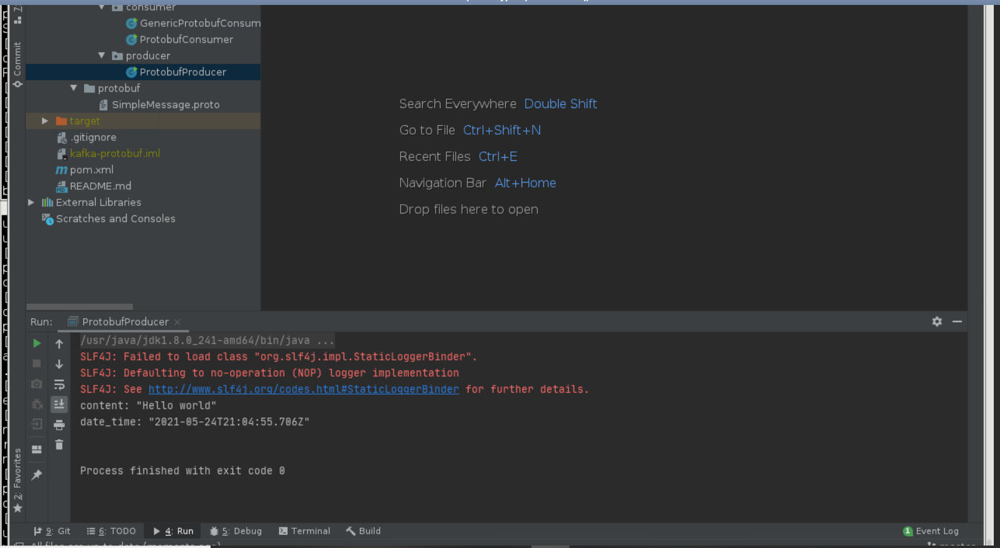
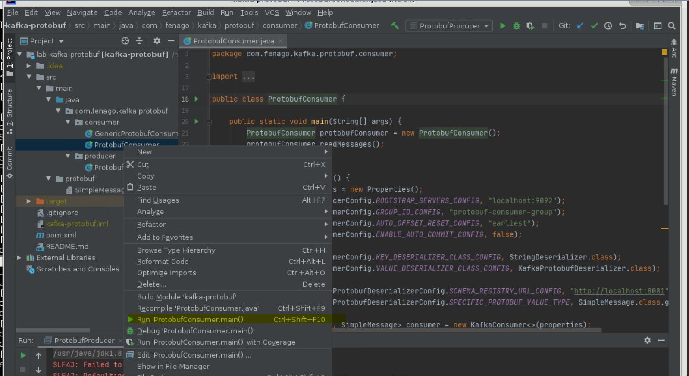
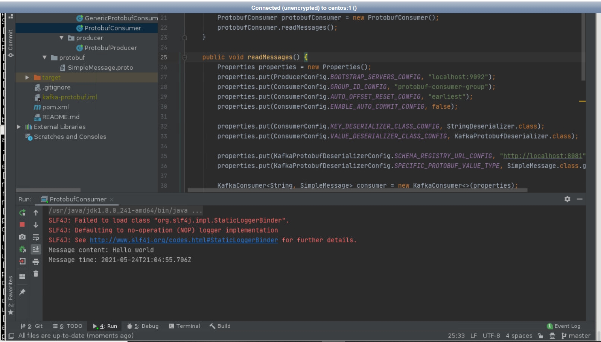
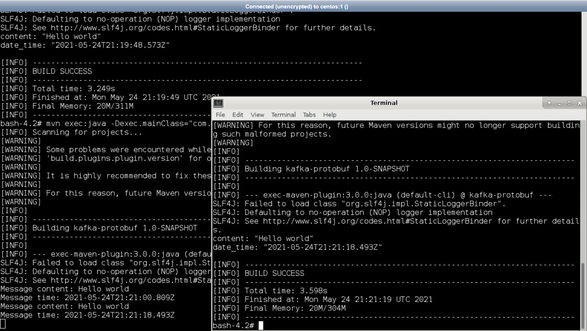

Lab : Working with Protobuf in Apache Kafka
============================================

Since Confluent Platform version 5.5 Avro is no longer the only schema
in town. Protobuf and JSON schemas are now supported as the first-class
citizens in Confluent universe.


Introduction to Protobuf
========================


Here’s an example of a Protobuf schema containing one message type:

```
syntax = "proto3";
package com.fenago.protobuf;
message SimpleMessage {
 string content = 1;
 string date_time = 2;
}
```

In the first line, we define that we’re using protobuf version 3. Our
message type called SimpleMessage defines two string fields: content and
date\_time. Each field is assigned a so-called **field number**, which
has to be unique in a message type. These numbers identify the fields
when the message is serialized to the Protobuf binary format. Google
suggests using numbers 1 through 15 for most frequently used fields
because it takes one byte to encode them.


Running a local Kafka cluster
=============================

Before we get started, let’s boot up a local Kafka cluster with the
Schema Registry, so we can try our out code right away.

Make sure that Zookeeper and Kafka are already running. Start them by running following script incase they are not running:


`~/kafka-training/run-zookeeper.sh`

Wait about 30 seconds or so for ZooKeeper to startup.

`~/kafka-training/run-kafka.sh`


#### Start Schema Registry

Confluence 6.1.1 has already been downloaded and extracted at following path `~/kafka-training/confluent-6.1.1` . Start schema registry by running following script in the terminal:

`~/kafka-training/run-schema_registry.sh`


Your local Kafka cluster is now ready to be used. Kafka broker is available on
port 9092, while the Schema Registry runs on port 8081. Make a note of
that, because we’ll need it soon.


#### Lab Solution 

Complete lab solution is available at following path. Run mvn commands to compile using maven cli:


```
cd ~/kafka-training/labs/lab-kafka-protobuf

mvn clean

mvn install
```

#### Intellij IDE

Open Intellij IDE and open following project headless/kafka-training/labs/lab-kafka-protobuf




Wait for some time for project to be imported




Code generation in Java
=======================

Now we know how a protobuf schema looks and we know how it ends up
in Schema Registry. Let’s see now how we use protobuf schemas from Java.

The first thing that you need is a protobuf-java library. In these
examples, I’m using maven, so let’s add the maven dependency:

```
<dependencies>
 <dependency>
  <groupId>com.google.protobuf</groupId>
  <artifactId>protobuf-java</artifactId>
  <version>3.12.2</version>
 </dependency>
</dependencies>
```

The next thing you want to do is use the **protoc** compiler to generate
Java code from .proto files. But we’re not going to invite the
compiler manually, we’ll use a maven plugin called
**protoc-jar-maven-plugin**:

```
<plugin>
    <groupId>com.github.os72</groupId>
    <artifactId>protoc-jar-maven-plugin</artifactId>
    <version>3.11.4</version>
    <executions>
        <execution>
            <phase>generate-sources</phase>
            <goals>
                <goal>run</goal>
            </goals>
            <configuration>
                <inputDirectories>
                  <include>${project.basedir}/src/main/protobuf</include>
                </inputDirectories>
                <outputTargets>
                    <outputTarget>
                        <type>java</type>
                        <addSources>main</addSources>
                        <outputDirectory>${project.basedir}/target/generated-sources/protobuf</outputDirectory>
                    </outputTarget>
                </outputTargets>
            </configuration>
        </execution>
    </executions>
</plugin>
```

The protobuf classes will be generated during the generate-sources
phase. The plugin will look for proto files in the
**src/main/protobuf** folder and the generated code will be created in
the **target/generated-sources/protobuf** folder.

To generate the class in the target folder run:

```
mvn clean generate-sources
```


Ok, now that we have our class generated, let’s send it to Kafka using
the new Protobuf serializer.


Writing a Protobuf Producer
===========================

With Kafka cluster up and running is now time to create a Java producer
that will send our SimpleMessage to Kafka. First, let’s prepare the
configuration for the Producer:

```
Properties properties = new Properties();
properties.put(ProducerConfig.BOOTSTRAP_SERVERS_CONFIG, "localhost:9092");
properties.put(ProducerConfig.KEY_SERIALIZER_CLASS_CONFIG, StringSerializer.class);
properties.put(ProducerConfig.VALUE_SERIALIZER_CLASS_CONFIG, KafkaProtobufSerializer.class);
properties.put(KafkaProtobufSerializerConfig.SCHEMA_REGISTRY_URL_CONFIG, "http://localhost:8081");
Producer<String, SimpleMessage> producer = new KafkaProducer<>(properties);
```

Notice that we are using **KafkaProtobufSerializer** as the value
serializer class. This is the new serializer available in Confluent
Platform since version 5.5. It works similarly to KafkaAvroSerializer:
when publishing messages it will check with Schema Registry if the
schema is available there. If the schema is not yet registered, it will
write it to Schema Registry and then publish the message to Kafka. For
this to work, the serializer needs the URL of the Schema Registry and in
our case, that’s [*http://localhost:8081*.](http://localhost:8081./)

Next, we prepare the KafkaRecord, using the SimpleMessage class
generated from the protobuf schema:

```
SimpleMessage simpleMessage = SimpleMessage.newBuilder()
     .setContent("Hello world")
        .setDateTime(Instant.now().toString())
        .build();
    
ProducerRecord<String, SimpleMessage> record
    = new ProducerRecord<>("protobuf-topic", null, simpleMessage);
```

This record will be written to the topic called **protobuf-topic**. The
last thing to do is to write the record to Kafka:

```
producer.send(record);
producer.flush();
producer.close();
```

Usually, you wouldn’t call **flush()** method, but since our application
will be stopped after this, we need to ensure the message is written to
Kafka before that happens.

Writing a Protobuf Consumer
===========================

We said that the consumer doesn’t need to know the schema in advance to
be able to deserialize the message, thanks to Schema Registry. But,
having the schema available in advance allows us to generate the Java
class out of it and use the class in our code. This helps with code
readability and makes a code strongly typed.

Here’s how to do it. First, you will generate a java class(es) as
explained in Code generation in Java section. Next, we prepare the
configuration for the Kafka consumer:

```
Properties properties = new Properties(); properties.put(ProducerConfig.BOOTSTRAP_SERVERS_CONFIG, 
    "localhost:9092"); 
properties.put(ConsumerConfig.GROUP_ID_CONFIG, 
    "protobuf-consumer-group"); 
properties.put(ConsumerConfig.AUTO_OFFSET_RESET_CONFIG, "earliest"); properties.put(ConsumerConfig.ENABLE_AUTO_COMMIT_CONFIG, false);
```

Here we’re defining a broker URL, consumer group of our consumer and
telling the consumer that we’ll handle offset commits ourselves.\
Next, we define deserializer for the messages:

```
properties.put(ConsumerConfig.KEY_DESERIALIZER_CLASS_CONFIG, 
    StringDeserializer.class); properties.put(ConsumerConfig.VALUE_DESERIALIZER_CLASS_CONFIG, 
    KafkaProtobufDeserializer.class); properties.put(KafkaProtobufDeserializerConfig.SCHEMA_REGISTRY_URL_CONFIG, "http://localhost:8081"); properties.put(KafkaProtobufDeserializerConfig.SPECIFIC_PROTOBUF_VALUE_TYPE, SimpleMessage.class.getName());
```

We use string deserializer for the key, but for the value, we’re using
the new KafkaProtobufDeserializer. For the protobuf deserializer, we
need to provide the Schema Registry URL, as we did for the serializer
above.

The last line is the most important. It tells the deserializer to which
class to deserializer the record values. In our case, it’s the
SimpleMessage class (the one we generated from the protobuf schema using
the protobuf maven plugin).

Now we’re ready to create our consumer and subscribe it to
**protobuf-topic**:

```
KafkaConsumer<String, SimpleMessage> consumer 
    = new KafkaConsumer<>(properties);
consumer.subscribe(Collections.singleton("protobuf-topic"));
```

And then we poll Kafka for records and print them to the console:

```
while (true) {
 ConsumerRecords<String, SimpleMessage> records 
     = consumer.poll(Duration.ofMillis(100));
 for (ConsumerRecord<String, SimpleMessage> record : records) {
  System.out.println("Message content: " + 
      record.value().getContent());
  System.out.println("Message time: " + 
      record.value().getDateTime());
 }
 consumer.commitAsync();
}
```

Here we’re consuming a batch of records and just printing the content to
the console.

Remember when we configured the consumer to let us handle committing
offsets by setting ENABLE\_AUTO\_COMMIT\_CONFIG to false? That’s what
we’re doing in the last line: only after we’ve fully processed the
current group of records will we commit the consumer offset.

That’s all there is to writing a simple protobuf consumer. Let’s now
check one more variant.


Generic Protobuf Consumer
=========================

What if you want to handle messages in a generic way in your consumer,
without generating a Java class from a protobuf schema? Well, you can
use an instance of DynamicMessage class from protobuf library.
DynamicMessage has a reflective API, so you can navigate through message
fields and read their values. Here’s how you can do it…

First, let’s configure the consumer. Its configuration is very similar
to the previous example:

```
Properties properties = new Properties();
properties.put(ProducerConfig.BOOTSTRAP_SERVERS_CONFIG, 
    "localhost:9092");
properties.put(ConsumerConfig.GROUP_ID_CONFIG, 
    "generic-protobuf-consumer-group");      
properties.put(ConsumerConfig.AUTO_OFFSET_RESET_CONFIG, "earliest");
properties.put(ConsumerConfig.ENABLE_AUTO_COMMIT_CONFIG, false);
properties.put(ConsumerConfig.KEY_DESERIALIZER_CLASS_CONFIG, 
    StringDeserializer.class);
properties.put(ConsumerConfig.VALUE_DESERIALIZER_CLASS_CONFIG, 
    KafkaProtobufDeserializer.class);
properties.put(KafkaProtobufDeserializerConfig.SCHEMA_REGISTRY_URL_CONFIG, "http://localhost:8081");
```

The only thing missing is the **SPECIFIC\_PROTOBUF\_VALUE\_TYPE**
configuration. Since we want to handle messages in a generic way, we
don’t need this configuration.

Now we’re ready to create our consumer and subscribe it to
**protobuf-topic** topic, as in the previous example:

```
KafkaConsumer<String, SimpleMessage> consumer 
    = new KafkaConsumer<>(properties);
consumer.subscribe(Collections.singleton("protobuf-topic"));
```

And then we poll Kafka for records and print them to the console:

```
while (true) {
  ConsumerRecords<String, DynamicMessage> records 
      = consumer.poll(Duration.ofMillis(100));
  for (ConsumerRecord<String, DynamicMessage> record : records) {
    for (FieldDescriptor field : 
        record.value().getAllFields().keySet()) {
      System.out.println(field.getName() + ": " + 
          record.value().getField(field));
    }
  }
  consumer.commitAsync();
}
```

Without SPECIFIC\_PROTOBUF\_VALUE\_TYPE configured in our consumer, the
consumer will always return the instance of DynamicMessage in the
record’s value. Then we use the **DynamicMessage.getAllFields()** method
to obtain the list of FieldDescriptors. Once we have all the descriptors
we can simply iterate through them and print the value of each field.

Check out the JavaDoc to find out more about
[DynamicMessage](https://developers.google.com/protocol-buffers/docs/reference/java/com/google/protobuf/DynamicMessage).


#### Running Solution with Intellij

**Starting Producer**





**Starting Consumer**






#### Running Solution with Maven

**Step 1: Compile** (Terminal 1)

```
cd ~/kafka-training/labs/lab-kafka-protobuf

mvn clean compile
```

 
**Step 2: Run ProtobufConsumer** (Terminal 1)

Execute the class, ProtobufConsumer by running:

```
mvn exec:java -Dexec.mainClass="com.fenago.kafka.protobuf.consumer.ProtobufConsumer"
```

Open new terminal before proceeding to next step.


**Step 3: Run ProtobufProducer** (Terminal 2)

Execute the class, ProtobufProducer by running:

```
mvn exec:java -Dexec.mainClass="com.fenago.kafka.protobuf.producer.ProtobufProducer"
```

Run producer class multiple times and verify that message is displayed in consumer logs:




Now you’re ready to start writing producers and consumers that send Protobuf messages to Apache Kafka with
help of Schema Registry.

