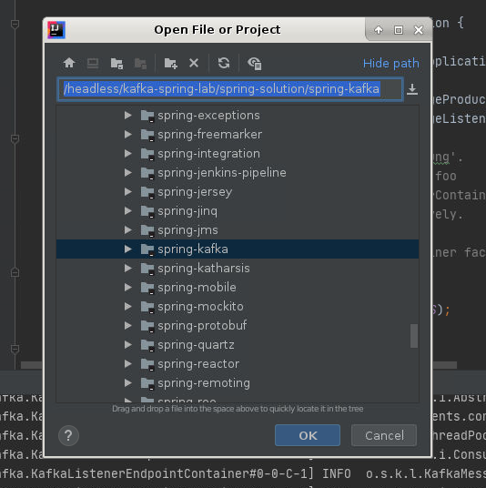
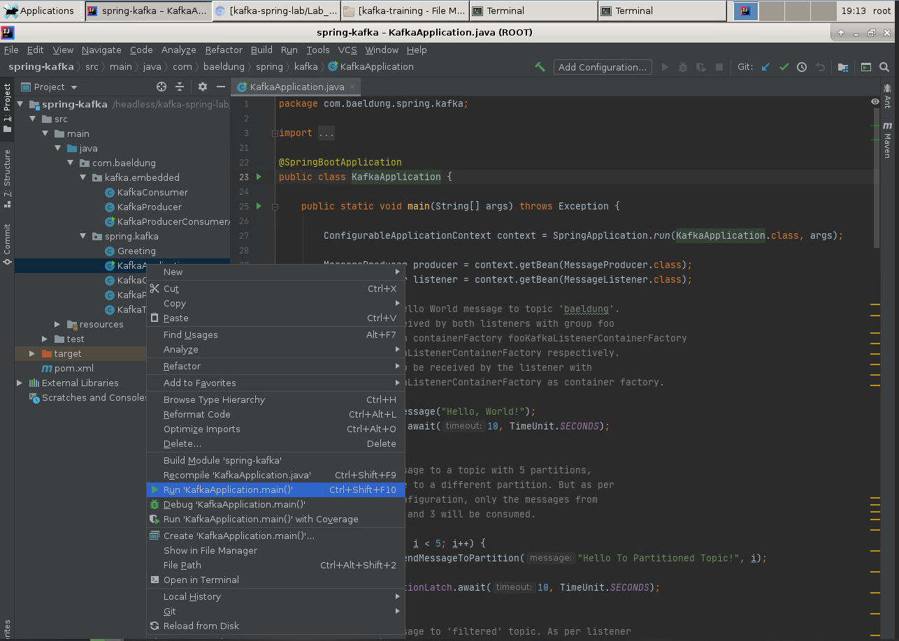
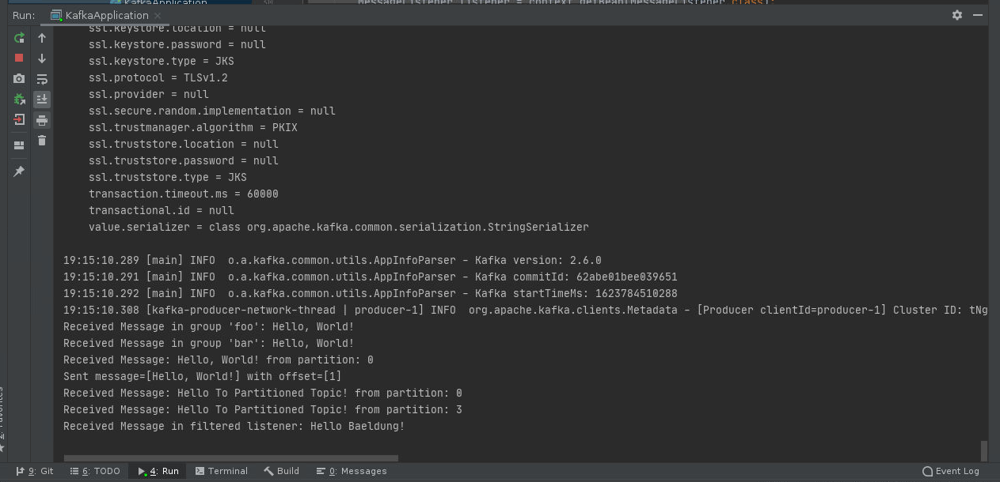

Apache Kafka with Spring
=========================

**1. Overview**

In this lab, we'll cover Spring support for Kafka and the level of
abstractions it provides over native Kafka Java client APIs. We will devleop a Spring Boot app to demonstrate sending and receiving of messages in Kafka using spring-kafka.

Spring Kafka brings the simple and typical Spring template programming
model with a *KafkaTemplate* and Message-driven POJOs via
*@KafkaListener* annotation.

### Lab Solution

Complete solution for this lab is available at github:

`cd ~ && git clone https://github.com/fenago/kafka-spring-lab.git`

`cd kafka-spring-lab/spring-solution/spring-kafka`

`mvn clean compile`

Open folder in IntelliJ after running above commands.

Make sure that kafka and zookeeper is running.

**2. PreReq and Setup**

Make sure that kafka and zookeeper is running:

We need to add the *spring-kafka* dependency to our *pom.xml*:

    <dependency>
        <groupId>org.springframework.kafka</groupId>
        <artifactId>spring-kafka</artifactId>
        <version>2.5.8.RELEASE</version>
    </dependency>

Our example application will be a Spring Boot application.

**3. Configuring Topics**

As Kafka topics are not created automatically by default, this application requires that you create the following topics manually.

`$ cd ~/kafka-training/kafka` 

`$ bin/kafka-topics.sh --create --zookeeper localhost:2181 --replication-factor 1 --partitions 1 --topic baeldung` 

`$ bin/kafka-topics.sh --create --zookeeper localhost:2181 --replication-factor 1 --partitions 5 --topic partitioned` 

`$ bin/kafka-topics.sh --create --zookeeper localhost:2181 --replication-factor 1 --partitions 1 --topic filtered` 

`$ bin/kafka-topics.sh --create --zookeeper localhost:2181 --replication-factor 1 --partitions 1 --topic greeting` 

**We need to add the *KafkaAdmin* Spring bean, which will automatically
add topics for all beans of type *NewTopic***:

    @Configuration
    public class KafkaTopicConfig {
        
        @Value(value = "${kafka.bootstrapAddress}")
        private String bootstrapAddress;

        @Bean
        public KafkaAdmin kafkaAdmin() {
            Map<String, Object> configs = new HashMap<>();
            configs.put(AdminClientConfig.BOOTSTRAP_SERVERS_CONFIG, bootstrapAddress);
            return new KafkaAdmin(configs);
        }
        
        @Bean
        public NewTopic topic1() {
             return new NewTopic("baeldung", 1, (short) 1);
        }
    }

**4. Producing Messages**

To create messages, we first need to configure a
[*ProducerFactory*](https://docs.spring.io/spring-kafka/api/org/springframework/kafka/core/ProducerFactory.html).
This sets the strategy for creating Kafka
[*Producer*](https://kafka.apache.org/0100/javadoc/org/apache/kafka/clients/producer/Producer.html)
instances.

Then we need a
[*KafkaTemplate*](https://docs.spring.io/spring-kafka/api/org/springframework/kafka/core/KafkaTemplate.html),
which wraps a *Producer* instance and provides convenience methods for
sending messages to Kafka topics.

*Producer* instances are thread safe. So, using a single instance
throughout an application context will give higher performance.
Consequently, *KakfaTemplate* instances are also thread safe, and use of
one instance is recommended.

**4.1. Producer Configuration**

    @Configuration
    public class KafkaProducerConfig {

        @Bean
        public ProducerFactory<String, String> producerFactory() {
            Map<String, Object> configProps = new HashMap<>();
            configProps.put(
              ProducerConfig.BOOTSTRAP_SERVERS_CONFIG, 
              bootstrapAddress);
            configProps.put(
              ProducerConfig.KEY_SERIALIZER_CLASS_CONFIG, 
              StringSerializer.class);
            configProps.put(
              ProducerConfig.VALUE_SERIALIZER_CLASS_CONFIG, 
              StringSerializer.class);
            return new DefaultKafkaProducerFactory<>(configProps);
        }

        @Bean
        public KafkaTemplate<String, String> kafkaTemplate() {
            return new KafkaTemplate<>(producerFactory());
        }
    }

**4.2. Publishing Messages**

We can send messages using the *KafkaTemplate* class:

    @Autowired
    private KafkaTemplate<String, String> kafkaTemplate;

    public void sendMessage(String msg) {
        kafkaTemplate.send(topicName, msg);
    }

**The *send* API returns a *ListenableFuture* object.** If we want to
block the sending thread and get the result about the sent message, we
can call the *get*API of the *ListenableFuture* object. The thread will
wait for the result, but it will slow down the producer.

Kafka is a fast stream processing platform. Therefore, it's better to
handle the results asynchronously so that the subsequent messages do not
wait for the result of the previous message.

We can do this through a callback:

    public void sendMessage(String message) {
                
        ListenableFuture<SendResult<String, String>> future = 
          kafkaTemplate.send(topicName, message);
        
        future.addCallback(new ListenableFutureCallback<SendResult<String, String>>() {

            @Override
            public void onSuccess(SendResult<String, String> result) {
                System.out.println("Sent message=[" + message + 
                  "] with offset=[" + result.getRecordMetadata().offset() + "]");
            }
            @Override
            public void onFailure(Throwable ex) {
                System.out.println("Unable to send message=[" 
                  + message + "] due to : " + ex.getMessage());
            }
        });
    }

**5. Consuming Messages**

**5.1. Consumer Configuration**

For consuming messages, we need to configure a
*[ConsumerFactory](https://docs.spring.io/autorepo/docs/spring-kafka-dist/1.1.3.RELEASE/api/org/springframework/kafka/core/ConsumerFactory.html)*
and a
[*KafkaListenerContainerFactory*](https://docs.spring.io/autorepo/docs/spring-kafka-dist/1.1.3.RELEASE/api/org/springframework/kafka/config/KafkaListenerContainerFactory.html).
Once these beans are available in the Spring bean factory, POJO-based
consumers can be configured using
[*@KafkaListener*](https://docs.spring.io/autorepo/docs/spring-kafka-dist/1.1.3.RELEASE/api/org/springframework/kafka/annotation/KafkaListener.html)
annotation.

**[*@EnableKafka*](https://docs.spring.io/autorepo/docs/spring-kafka-dist/1.1.3.RELEASE/api/org/springframework/kafka/annotation/EnableKafka.html)
annotation is required on the configuration class to enable detection of
*@KafkaListener* annotation on spring-managed beans**:

    @EnableKafka
    @Configuration
    public class KafkaConsumerConfig {

        @Bean
        public ConsumerFactory<String, String> consumerFactory() {
            Map<String, Object> props = new HashMap<>();
            props.put(
              ConsumerConfig.BOOTSTRAP_SERVERS_CONFIG, 
              bootstrapAddress);
            props.put(
              ConsumerConfig.GROUP_ID_CONFIG, 
              groupId);
            props.put(
              ConsumerConfig.KEY_DESERIALIZER_CLASS_CONFIG, 
              StringDeserializer.class);
            props.put(
              ConsumerConfig.VALUE_DESERIALIZER_CLASS_CONFIG, 
              StringDeserializer.class);
            return new DefaultKafkaConsumerFactory<>(props);
        }

        @Bean
        public ConcurrentKafkaListenerContainerFactory<String, String> 
          kafkaListenerContainerFactory() {
       
            ConcurrentKafkaListenerContainerFactory<String, String> factory =
              new ConcurrentKafkaListenerContainerFactory<>();
            factory.setConsumerFactory(consumerFactory());
            return factory;
        }
    }

**5.2. Consuming Messages**

    @KafkaListener(topics = "topicName", groupId = "foo")
    public void listenGroupFoo(String message) {
        System.out.println("Received Message in group foo: " + message);
    }

**We can implement multiple listeners for a topic**, each with a
different group Id. Furthermore, one consumer can listen for messages
from various topics:

    @KafkaListener(topics = "topic1, topic2", groupId = "foo")

Spring also supports retrieval of one or more message headers using the
[*@Header*](https://docs.spring.io/spring/docs/current/javadoc-api/org/springframework/messaging/handler/annotation/Header.html)
annotation in the listener:

    @KafkaListener(topics = "topicName")
    public void listenWithHeaders(
      @Payload String message, 
      @Header(KafkaHeaders.RECEIVED_PARTITION_ID) int partition) {
          System.out.println(
            "Received Message: " + message"
            + "from partition: " + partition);
    }

**5.3. Consuming Messages from a Specific Partition**

Notice that we created the topic *baeldung* with only one partition.

For a topic with multiple partitions, however, a *@KafkaListener* can
explicitly subscribe to a particular partition of a topic with an
initial offset:

    @KafkaListener(
      topicPartitions = @TopicPartition(topic = "topicName",
      partitionOffsets = {
        @PartitionOffset(partition = "0", initialOffset = "0"), 
        @PartitionOffset(partition = "3", initialOffset = "0")}),
      containerFactory = "partitionsKafkaListenerContainerFactory")
    public void listenToPartition(
      @Payload String message, 
      @Header(KafkaHeaders.RECEIVED_PARTITION_ID) int partition) {
          System.out.println(
            "Received Message: " + message"
            + "from partition: " + partition);
    }

Since the *initialOffset* has been set to 0 in this listener, all the
previously consumed messages from partitions 0 and 3 will be re-consumed
every time this listener is initialized.

If we don't need to set the offset, we can use the *partitions* property
of *@TopicPartition* annotation to set only the partitions without the
offset:

    @KafkaListener(topicPartitions 
      = @TopicPartition(topic = "topicName", partitions = { "0", "1" }))

**5.4. Adding Message Filter for Listeners**

We can configure listeners to consume specific types of messages by
adding a custom filter. This can be done by setting a
*[RecordFilterStrategy](https://docs.spring.io/spring-kafka/api/org/springframework/kafka/listener/adapter/RecordFilterStrategy.html)*
to the *KafkaListenerContainerFactory*:

    @Bean
    public ConcurrentKafkaListenerContainerFactory<String, String>
      filterKafkaListenerContainerFactory() {

        ConcurrentKafkaListenerContainerFactory<String, String> factory =
          new ConcurrentKafkaListenerContainerFactory<>();
        factory.setConsumerFactory(consumerFactory());
        factory.setRecordFilterStrategy(
          record -> record.value().contains("World"));
        return factory;
    }

We can then configure a listener to use this container factory:

    @KafkaListener(
      topics = "topicName", 
      containerFactory = "filterKafkaListenerContainerFactory")
    public void listenWithFilter(String message) {
        System.out.println("Received Message in filtered listener: " + message);
    }

In this listener, all the **messages matching the filter will be discarded.**

**6. Custom Message Converters**

So far, we have only covered sending and receiving Strings as messages.
However, we can also send and receive custom Java objects. This requires
configuring appropriate serializer in *ProducerFactory* and deserializer
in *ConsumerFactory*.

Let's look at a simple bean class*,* which we will send as messages:

    public class Greeting {

        private String msg;
        private String name;

        // standard getters, setters and constructor
    }

**6.1. Producing Custom Messages**

In this example, we will use
*[JsonSerializer](https://docs.spring.io/spring-kafka/api/org/springframework/kafka/support/serializer/JsonSerializer.html)*.

Let's look at the code for *ProducerFactory* and*KafkaTemplate*:

    @Bean
    public ProducerFactory<String, Greeting> greetingProducerFactory() {
        // ...
        configProps.put(
          ProducerConfig.VALUE_SERIALIZER_CLASS_CONFIG, 
          JsonSerializer.class);
        return new DefaultKafkaProducerFactory<>(configProps);
    }

    @Bean
    public KafkaTemplate<String, Greeting> greetingKafkaTemplate() {
        return new KafkaTemplate<>(greetingProducerFactory());
    }

We can use this new *KafkaTemplate* to send the *Greeting* message:

    kafkaTemplate.send(topicName, new Greeting("Hello", "World"));

**6.2. Consuming Custom Messages**

Similarly, let's modify the *ConsumerFactory* and
*KafkaListenerContainerFactory* to deserialize the Greeting message
correctly:

    @Bean
    public ConsumerFactory<String, Greeting> greetingConsumerFactory() {
        // ...
        return new DefaultKafkaConsumerFactory<>(
          props,
          new StringDeserializer(), 
          new JsonDeserializer<>(Greeting.class));
    }

    @Bean
    public ConcurrentKafkaListenerContainerFactory<String, Greeting> 
      greetingKafkaListenerContainerFactory() {

        ConcurrentKafkaListenerContainerFactory<String, Greeting> factory =
          new ConcurrentKafkaListenerContainerFactory<>();
        factory.setConsumerFactory(greetingConsumerFactory());
        return factory;
    }

The spring-kafka JSON serializer and deserializer uses the
Jackson library, which is also an
optional Maven dependency for the spring-kafka project.

So, let's add it to our *pom.xml*:

    <dependency>
        <groupId>com.fasterxml.jackson.core</groupId>
        <artifactId>jackson-databind</artifactId>
        <version>2.9.7</version>
    </dependency>

Instead of using the latest version of Jackson, it's recommended to use
the version that is added to the *pom.xml* of spring-kafka.

Finally, we need to write a listener to consume *Greeting* messages:

    @KafkaListener(
      topics = "topicName", 
      containerFactory = "greetingKafkaListenerContainerFactory")
    public void greetingListener(Greeting greeting) {
        // process greeting message
    }

When the application runs successfully, following output is logged on to console (along with spring logs):

#### Message received from the 'baeldung' topic by the basic listeners with groups foo and bar
>Received Message in group 'foo': Hello, World! 
Received Message in group 'bar': Hello, World!

#### Message received from the 'baeldung' topic, with the partition info
>Received Message: Hello, World! from partition: 0

#### Message received from the 'partitioned' topic, only from specific partitions
>Received Message: Hello To Partioned Topic! from partition: 0 
Received Message: Hello To Partioned Topic! from partition: 3

#### Message received from the 'filtered' topic after filtering
>Received Message in filtered listener: Hello Baeldung!

#### Message (Serialized Java Object) received from the 'greeting' topic
>Received greeting message: Greetings, World!!

**7. Conclusion**

In this lab, we covered Spring support for Apache
Kafka. We took a brief look at the classes used for sending and
receiving messages.

Before running the code, please make sure that Kafka server is running
and that the topics are created manually.

