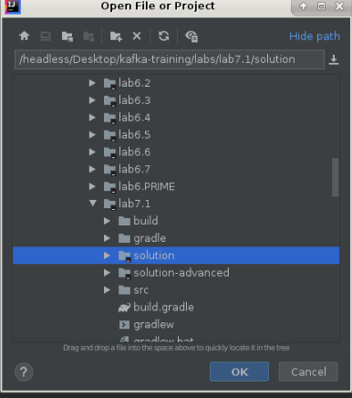
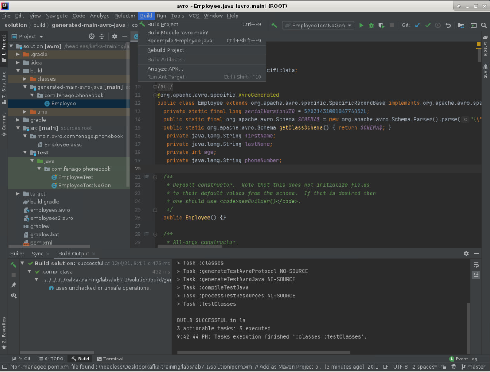
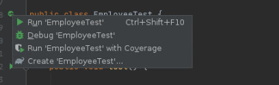
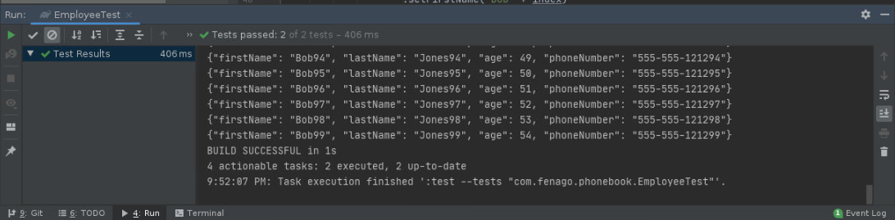
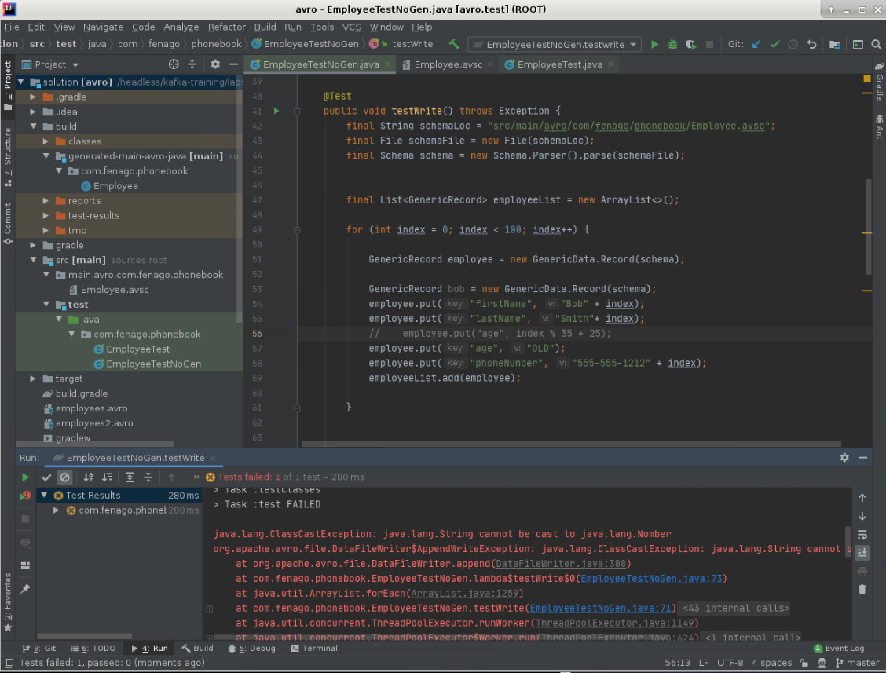
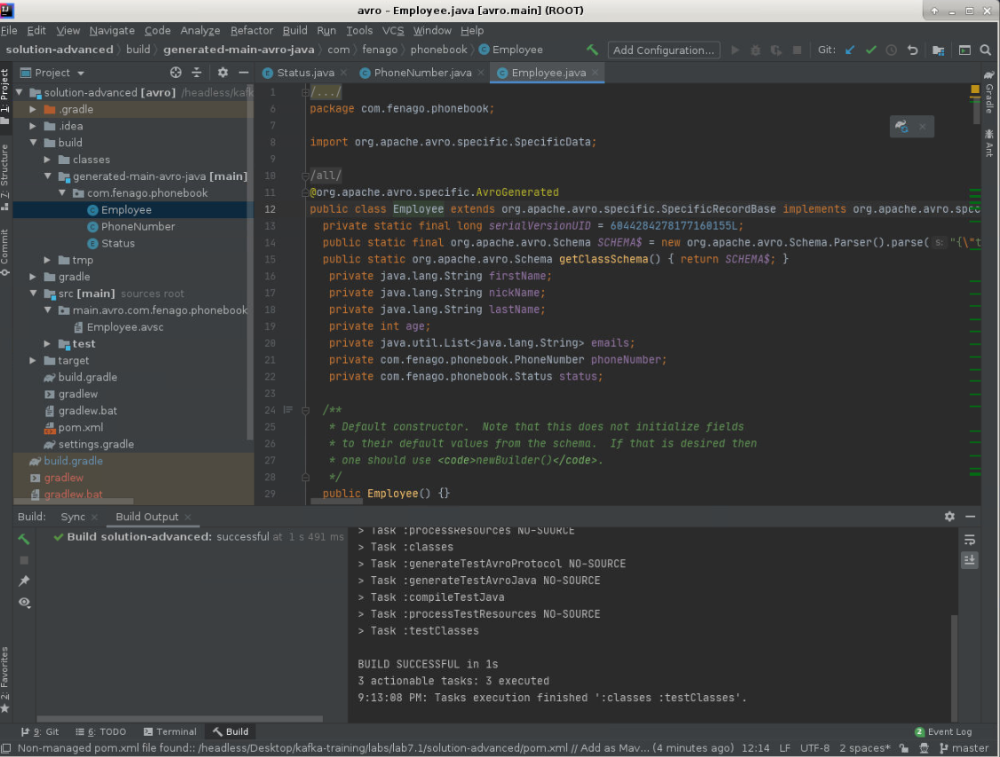

# Lab 7.1: Avro

Welcome to the session 7 lab 1. The work for this lab is done in `~/kafka-training/labs/lab7.1`. In this lab, you are going to use Avro.

<span style="color:red;">Select Gradle while opening project in IntelliJ IDE</span>


**Note:** Solution is available in following directory:
`~/kafka-training/labs/lab7.1/solution`



### Avro Schema
Let's take a look at an example Avro schema.

#### ./src/main/avro/com/fenago/phonebook/Employee.avsc
#### Example schema for an Employee record

```javascript
{"namespace": "com.fenago.phonebook",
  "type": "record",  "name": "Employee",
    "fields": [
        {"name": "firstName", "type": "string"},
        {"name": "lastName", "type": "string"},
        {"name": "age",  "type": "int"},
        {"name": "phoneNumber",  "type": "string"}
    ]
}
```

The above defines an employee record with firstName, lastName, age and phoneNumber.


***ACTION*** - EDIT Employee.avsc and modify it to match the above code listing.


## Avro schema generation tools

Avro comes with a set of tools for generating Java classes for Avro types that you
define in Avro schema. There are plugins for Maven and Gradle to generate code based
on Avro schemas.

This `gradle-avro-plugin` is a Gradle plugin that uses Avro tools to do Java code generation
for Apache Avro.
This plugin supports Avro schema files (`.avsc`), and Avro RPC IDL (`.avdl`).
For Kafka Training Course, Instructor led, onsite training")
you only need `avsc` schema files.

#### build.gradle - example using gradle-avro-plugin

```java
plugins {
    id "com.commercehub.gradle.plugin.avro" version "0.9.0"
}

group 'fenago'
version '1.0-SNAPSHOT'
apply plugin: 'java'
sourceCompatibility = 1.8

dependencies {
    compile "org.apache.avro:avro:1.8.1"
    testCompile 'junit:junit:4.12'
    compile 'junit:junit:4.12'
}

repositories {
    jcenter()
    mavenCentral()
}

avro {
    createSetters = false
    fieldVisibility = "PRIVATE"
}

wrapper {
    gradleVersion = "4.7"
}

sourceSets{
    main {
        java {
            srcDir 'src'
            srcDir 'build/generated-main-avro-java'
        }
    }
}
```


***ACTION*** - Open build.gradle and verify file content.

Notice that we did not generate setter methods, and we made the fields private.
This makes the instances somewhat immutable.

Click `Build` > `Rebuild Project` from IntelliJ IDE to generate the Employee.java.

#### ./build/generated-main-avro-java/com/fenago/phonebook/Employee.java
#### Generated Avro code

```java

package com.fenago.phonebook;

import org.apache.avro.specific.SpecificData;

@SuppressWarnings("all")
@org.apache.avro.specific.AvroGenerated
public class Employee extends org.apache.avro.specific.SpecificRecordBase implements org.apache.avro.specific.SpecificRecord {
  private static final long serialVersionUID = -6112285611684054927L;
  public static final org.apache.avro.Schema SCHEMA$ = new
                        org.apache.avro.Schema.Parser().parse("{\"type\":\"record\",\"name\":\"Employee\"...");
  public static org.apache.avro.Schema getClassSchema() { return SCHEMA$; }
  private java.lang.String firstName;
  private java.lang.String lastName;
  private int age;
  private java.lang.String phoneNumber;
  ...

```


***ACTION*** - Click `Build` > `Rebuild Project` in IntelliJ IDE,

The gradle plugin calls the Avro utilities which generates the files and puts them under
`build/generated-main-avro-java`



Let's use the generated class as follows to construct an Employee instance.


#### Using the new Employee class

Edit `EmployeeTest.java`

```java
Employee bob = Employee.newBuilder().setAge(35)
        .setFirstName("Bob")
        .setLastName("Jones")
        .setPhoneNumber("555-555-1212")
        .build();

assertEquals("Bob", bob.getFirstName());

```

The Employee class has a constructor and has a builder.
We can use the builder to build a new Employee instance.


Next we want to write the Employees to disk.

#### Writing a list of employees to an Avro file

```java
final List<Employee> employeeList = ...
final DatumWriter<Employee> datumWriter = new SpecificDatumWriter<>(Employee.class);
final DataFileWriter<Employee> dataFileWriter = new DataFileWriter<>(datumWriter);

try {
    dataFileWriter.create(employeeList.get(0).getSchema(),
            new File("employees.avro"));
    employeeList.forEach(employee -> {
        try {
            dataFileWriter.append(employee);
        } catch (IOException e) {
            throw new RuntimeException(e);
        }

    });
} finally {
    dataFileWriter.close();
}

```

The above shows serializing an Employee list to disk. In Kafka, we will not be writing to
disk directly. We are just showing how so you have a way to test Avro serialization, which
is helpful when debugging schema incompatibilities. Note we create a `DatumWriter`, which
converts Java instance into an in-memory serialized format. `SpecificDatumWriter` is used
with generated classes like Employee. `DataFileWriter` writes the serialized records to
the `employee.avro` file.

Now let's demonstrate how to read data from an Avro file.

#### Reading a list of employees from an avro file

```java
final File file = new File("employees.avro");
final List<Employee> employeeList = new ArrayList<>();
final DatumReader<Employee> empReader = new SpecificDatumReader<>(Employee.class);
final DataFileReader<Employee> dataFileReader = new DataFileReader<>(file, empReader);

while (dataFileReader.hasNext()) {
    employeeList.add(dataFileReader.next(new Employee()));
}

```

The above deserializes employees from the `employees.avro` file into a `java.util.List` of
Employee instances. Deserializing is similar to serializing but in reverse. We create a
`SpecificDatumReader` to converts in-memory serialized items into instances of our generated
`Employee` class. The `DatumReader` reads records from the file by calling next.
Another way to read is using forEach as follows:


#### Reading a list of employees from an avro file using forEach
```java
final DataFileReader<Employee> dataFileReader = new DataFileReader<>(file, empReader);
dataFileReader.forEach(employeeList::add);
```


***ACTION*** - EDIT `src/test/java/com/fenago/phonebook/EmployeeTest.java` and follow the instructions in the file.

***ACTION*** - RUN EmployeeTest from the IDE





## Working with Generic Records

You can use a `GenericRecord` instead of generating an Employee class as follows.

Edit `EmployeeTestNoGen.java`

#### Using GenericRecord to create an Employee record

```java
final String schemaLoc = "src/main/avro/com/fenago/phonebook/Employee.avsc";
final File schemaFile = new File(schemaLoc);
final Schema schema = new Schema.Parser().parse(schemaFile);

GenericRecord bob = new GenericData.Record(schema);
bob.put("firstName", "Bob");
bob.put("lastName", "Smith");
bob.put("age", 35);
bob.put("phoneNumber", "555-555-1212");
assertEquals("Bob", bob.get("firstName"));
```

You can write to Avro files using GenericRecords as well.


#### Writing GenericRecords to an Avro file

```java
final List<GenericRecord> employeeList = new ArrayList<>();


final DatumWriter<GenericRecord> datumWriter = new GenericDatumWriter<>(schema);
final DataFileWriter<GenericRecord> dataFileWriter = new DataFileWriter<>(datumWriter);

try {
    dataFileWriter.create(employeeList.get(0).getSchema(),
            new File("employees2.avro"));
    employeeList.forEach(employee -> {
        try {
            dataFileWriter.append(employee);
        } catch (IOException e) {
            throw new RuntimeException(e);
        }
    });
} finally {
    dataFileWriter.close();
}
```


You can read from Avro files using `GenericRecord`s as well.


#### Reading GenericRecords from an Avro file
```java
final File file = new File("employees2.avro");
final List<GenericRecord> employeeList = new ArrayList<>();
final DatumReader<GenericRecord> empReader = new GenericDatumReader<>();
final DataFileReader<GenericRecord> dataFileReader = new DataFileReader<>(file, empReader);

while (dataFileReader.hasNext()) {
    employeeList.add(dataFileReader.next(null));
}

employeeList.forEach(System.out::println);

```

Avro will validate the data types when it serializes and deserializes the data.

#### Using the wrong type

```java
GenericRecord employee = new GenericData.Record(schema);
employee.put("firstName", "Bob" + index);
employee.put("lastName", "Smith"+ index);
//employee.put("age", index % 35 + 25);
employee.put("age", "OLD");
```

#### Stack trace from above
```

org.apache.avro.file.DataFileWriter$AppendWriteException: java.lang.ClassCastException:
java.lang.String cannot be cast to java.lang.Number

    at org.apache.avro.file.DataFileWriter.append(DataFileWriter.java:308)
    at com.fenago.phonebook.EmployeeTestNoGen.lambda$testWrite$1(EmployeeTestNoGen.java:71)
    at java.util.ArrayList.forEach(ArrayList.java:1249)
    at com.fenago.phonebook.EmployeeTestNoGen.testWrite(EmployeeTestNoGen.java:69)
    ...
Caused by: java.lang.ClassCastException: java.lang.String cannot be cast to java.lang.Number
    at org.apache.avro.generic.GenericDatumWriter.writeWithoutConversion(GenericDatumWriter.java:117)
    at org.apache.avro.generic.GenericDatumWriter.write(GenericDatumWriter.java:73)
    at org.apache.avro.generic.GenericDatumWriter.writeField(GenericDatumWriter.java:153)
    at org.apache.avro.generic.GenericDatumWriter.writeRecord(GenericDatumWriter.java:143)
    at org.apache.avro.generic.GenericDatumWriter.writeWithoutConversion(GenericDatumWriter.java:105)
    at org.apache.avro.generic.GenericDatumWriter.write(GenericDatumWriter.java:73)
    at org.apache.avro.generic.GenericDatumWriter.write(GenericDatumWriter.java:60)
    at org.apache.avro.file.DataFileWriter.append(DataFileWriter.java:302)
```



If you left out a required field like `firstName`, then you would get this.

#### Stack trace from leaving out firstName
```
Caused by: java.lang.NullPointerException: null of string in field firstName of com.fenago.phonebook.Employee
    at org.apache.avro.generic.GenericDatumWriter.npe(GenericDatumWriter.java:132)
    at org.apache.avro.generic.GenericDatumWriter.writeWithoutConversion(GenericDatumWriter.java:126)
    at org.apache.avro.generic.GenericDatumWriter.write(GenericDatumWriter.java:73)
    at org.apache.avro.generic.GenericDatumWriter.write(GenericDatumWriter.java:60)

```

In the Avro schema, you can define Records, Arrays, Enums, Unions, Maps and you can use primitive types like  String, Int, Boolean, Decimal, Timestamp, Date, and more.


Let's add to the Employee schema and show some of the different types that Avro supports.


***ACTION*** - EDIT `src/test/java/com/fenago/phonebook/EmployeeTestNoGen.java` and follow the instructions in the file.

***ACTION*** - RUN EmployeeTestNoGen from the IDE

***ACTION*** - CHANGE Change a test and leave out the firstName what happens?

***ACTION*** - CHANGE Change a test and use a string for age what happens?


## Working with more advanced schema

**Note:** Solution is available in following directory:
`~/kafka-training/labs/lab7.1/solution-advanced`


#### More advanced schema - `src/main/avro/com/fenago/phonebook/Employee.avsc`

```javascript
 {"namespace": "com.fenago.phonebook",
  "type": "record",
  "name": "Employee",
  "fields": [
    {"name": "firstName", "type": "string"},
    {"name": "nickName", "type": ["null", "string"], "default" : null},
    {"name": "lastName", "type": "string"},
    {"name": "age",  "type": "int"},
    {"name": "emails", "default":[], "type":{"type": "array", "items": "string"}},
    {"name": "phoneNumber",  "type":
      [ "null",
        { "type": "record",   "name": "PhoneNumber",
        "fields": [
          {"name": "areaCode", "type": "string"},
          {"name": "countryCode", "type": "string", "default" : ""},
          {"name": "prefix", "type": "string"},
          {"name": "number", "type": "string"}
        ]
        }
      ]
    },
    {"name":"status", "default" :"SALARY", "type": { "type": "enum", "name": "Status",
              "symbols" : ["RETIRED", "SALARY", "HOURLY", "PART_TIME"]}
    }
  ]
}
```


***ACTION*** - EDIT Employee.avsc and modify it to match the above code listing.

***ACTION*** - Generate classes using IntelliJ IDE. Click `Build` > `Rebuild Project`



Avro record attributes are as follows:

* name:  name of the record (required).
* namespace: equates to packages or modules
* doc: documentation for future user of this schema
* aliases:  array aliases (alias names)
* fields:  an array of fields

Avro field attributes are as follows:

* name:  name of the field (required)
* doc: description of field (important for future usage)
* type:  JSON object defining a schema, or a JSON string naming a record definition (required)
* default: Default value for this field
* order: specifies sort ordering of record (optional, ascending, descending, ignore)
 * aliases: array of alternate names

The `doc` attribute is imperative for future usage as it documents what the fields and
records are supposed to represent. Remember that this data can outlive systems that
produced it. A self-documenting schema is critical for a robust system.

The above has examples of default values, arrays, primitive types, Records within records,
enums, and more.

The PhoneNumber object gets generated as does the Status class.

#### PhoneNumber record
```java

package com.fenago.phonebook;

import org.apache.avro.specific.SpecificData;

@SuppressWarnings("all")
@org.apache.avro.specific.AvroGenerated
public class PhoneNumber extends org.apache.avro.specific.SpecificRecordBase ...{
  private static final long serialVersionUID = -3138777939618426199L;
  public static final org.apache.avro.Schema SCHEMA$ =
                   new org.apache.avro.Schema.Parser().parse("{\"type\":\"record\",\"name\":...
  public static org.apache.avro.Schema getClassSchema() { return SCHEMA$; }
   private java.lang.String areaCode;
   private java.lang.String countryCode;
   private java.lang.String prefix;
   private java.lang.String number;

```

#### Status enum
```java
package com.fenago.phonebook;
@SuppressWarnings("all")
@org.apache.avro.specific.AvroGenerated
public enum Status {
  RETIRED, SALARY, HOURLY, PART_TIME  ;
  ...
```


***ACTION*** - MODIFY Using solution and slides as a guide modify unit tests to use Status and PhoneNumber. Then run tests.


#### Tips for using Avro with Kafka and Hadoop

Avoid advanced Avro features which are not supported by polyglot language mappings.
Think simple data transfer objects or structs. Don't use magic strings,  use enums
instead as they provide better validation.

Document all records and fields in the schema.
Documentation is imperative for future usage. Documents what the fields and records
represent.  A self-documenting schema is critical for a robust streaming system and Big Data.
Don't use complex union types. Use Unions for nullable fields only and avoid using
recursive types at all costs.

Use reasonable field names and use them consistently with other records. Example,
`employee_id` instead of `id` and then use `employee_id` in all other records that
have a field that refer to the `employee_id` from Employee.


## Conclusion

Avro provides fast, compact data serialization. It supports data structures like Records, Maps, Array, and basic types.
You can use it direct or use Code Generation.